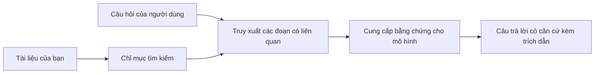

# Dạy AI Trả Lời Câu Hỏi Dựa Trên Tài Liệu Của Bạn:
## Phần 1: RAG, Azure và Các Phương Án Mã Nguồn Mở, Và Khi Nào Việc Tinh Chỉnh Có Ý Nghĩa

> Bài viết đầu tiên trong chuỗi năm 2026 ôn lại các hướng dẫn QA tài liệu Azure AI Search + Azure OpenAI năm 2023 của tôi.

Điều hướng chuỗi: [Trang chủ kho lưu trữ](../README.md) | Tiếp theo: [Chuỗi 2 - Xây dựng Hệ thống RAG Mã Nguồn Mở Cục Bộ Từ Đầu Đến Cuối](./series-2-open-source-rag-end-to-end.md)

## 1. Giới thiệu - Ôn Lại Hướng Dẫn RAG Trước Đây

Năm 2023, tôi đã làm việc trên một cặp bài hướng dẫn về việc dạy ChatGPT trả lời câu hỏi từ tài liệu PDF sử dụng Azure AI Search và Azure OpenAI. Tôi đã viết [phiên bản LangChain](https://techcommunity.microsoft.com/blog/educatordeveloperblog/teach-chatgpt-to-answer-questions-using-azure-ai-search--azure-openai-lang-chain/3969713), và cũng đồng tác giả phiên bản [Semantic Kernel kèm theo](https://techcommunity.microsoft.com/blog/educatordeveloperblog/teach-chatgpt-to-answer-questions-using-azure-ai-search--azure-openai-semantic-k/3985395) với [Lee Stott](https://developer.microsoft.com/en-us/advocates/lee-stott), một Quản lý Đại sứ đám mây cấp cao tại Microsoft. Lúc đó, ý tưởng "ChatGPT trên dữ liệu của bạn" vẫn còn mới mẻ đối với nhiều nhà phát triển. Các hướng dẫn sử dụng Azure Blob Storage, Azure AI Search, Azure OpenAI, LangChain, Semantic Kernel và truy vấn vectơ kiểu FAISS để trả lời câu hỏi từ tệp PDF.

Bài viết trước tập trung vào một quy trình đơn giản nhưng quan trọng: tải tài liệu lên, lập chỉ mục, truy xuất nội dung liên quan và hỏi mô hình trả lời dựa trên nội dung đó.

Năm 2026, hệ sinh thái RAG đã phát triển đáng kể. Azure AI Search hiện hỗ trợ các mẫu truy xuất vectơ hiện đại và truy xuất kết hợp, Azure OpenAI là một phần trong hệ sinh thái Microsoft Foundry Models rộng lớn hơn, và API v1 mới có thể sử dụng client OpenAI chuẩn mà không cần thay đổi `api-version` hàng tháng. Đồng thời, các lựa chọn mã nguồn mở như LangGraph, LlamaIndex, Haystack, Qdrant, Milvus, Weaviate, Chroma, Ollama và vLLM đã trở thành các lựa chọn thực tế cho hệ thống RAG thực thụ.

Đó là lý do tại sao tôi muốn ôn lại chủ đề này. Câu hỏi giờ đây không còn là "Làm sao để xây dựng RAG?" mà là có rất nhiều cách để xây dựng, và câu hỏi quan trọng hơn là "Kiến trúc nào tôi nên chọn cho tình huống của mình?"

Nhưng vấn đề cốt lõi vẫn không thay đổi.

Một mô hình AI không tự động biết tài liệu của bạn. Để xây dựng hệ thống hỏi đáp dựa trên tài liệu hữu ích, bạn vẫn cần quy trình truy xuất đáng tin cậy, làm nền tảng (grounding), đánh giá và vận hành.

Bài viết này không phải là một hướng dẫn "chat với PDF" từ đầu đến cuối nữa. Tôi muốn bắt đầu chuỗi bài cập nhật này với câu hỏi mà bây giờ tôi quan tâm hơn: khi nào bạn nên chọn kiến trúc Azure được quản lý, khi nào chọn bộ RAG mã nguồn mở, và khi nào việc tinh chỉnh thực sự có ý nghĩa?

Đây là bài viết đầu tiên trong chuỗi về xây dựng các hệ thống AI dựa trên tài liệu. Phần này chúng ta sẽ tập trung vào các quyết định kiến trúc: tại sao RAG quan trọng, khi nào các dịch vụ được quản lý dựa trên Azure hữu dụng, khi nào các lựa chọn mã nguồn mở phù hợp, và đâu là vị trí của tinh chỉnh.

Sau khi xây dựng và ôn lại các hệ thống QA tài liệu, tôi ngày càng ít quan tâm đến công cụ nào trông tốt trong bản demo mà tập trung hơn vào kiến trúc nào tồn tại được người dùng thực, tài liệu thay đổi, quyền truy cập, lỗi và bảo trì.

## 2. Tại Sao AI Của Bạn Cần Một Hệ Thống Tìm Kiếm

Các mô hình ngôn ngữ lớn được huấn luyện trên dữ liệu công khai và có cấp phép rộng rãi. Chúng có thể biết nhiều về các chủ đề chung, nhưng không tự động biết các PDF riêng tư của bạn, chính sách nội bộ, quy trình doanh nghiệp, kho lưu trữ nghiên cứu, tài liệu lớp học, ghi chú hỗ trợ khách hàng, hoặc tài liệu mới cập nhật.

Cách đơn giản để nghĩ về RAG là: thay vì hy vọng mô hình nhớ hết từng tài liệu, ta cung cấp cho nó một hệ thống tìm kiếm. Khi người dùng hỏi câu hỏi, hệ thống sẽ tìm những mảnh thông tin liên quan nhất, rồi đưa những mảnh đó cho mô hình làm ngữ cảnh.

Điều này quan trọng bởi vì nhiều nguồn kiến thức trong thực tế là riêng tư, thay đổi liên tục, nhạy cảm về quyền truy cập, lưu trữ trên nhiều hệ thống khác nhau, viết bằng nhiều định dạng khác nhau, và quá lớn để dán trực tiếp vào prompt.

Ví dụ, nếu một trường học, công ty hoặc nhóm nghiên cứu có 10.000 tài liệu nội bộ, mô hình không thể trả lời từ những tài liệu đó một cách đáng tin cậy trừ khi hệ thống truy xuất đúng phần đúng lúc.

Điều này tự nhiên dẫn đến câu hỏi phổ biến:

Tại sao không tinh chỉnh mô hình luôn?

Tinh chỉnh có thể hữu ích, nhưng thường không phải là công cụ đầu tiên đúng cho kiến thức tài liệu. Nếu kiến thức thay đổi thường xuyên, nếu trích dẫn quan trọng, hoặc nếu quyền truy cập quan trọng, RAG thường là điểm khởi đầu tốt hơn. Tinh chỉnh thích hợp hơn để dạy hành vi, phong cách, định dạng đầu ra, và mẫu công việc.

## 3. Kiến Trúc RAG Trong Thực Tiễn

Giả sử bạn xây dựng một trợ lý AI cho một trường học. Trợ lý cần trả lời câu hỏi từ các PDF chính sách, hướng dẫn khóa học, trang FAQ nội bộ, và các thông báo cập nhật gần đây.

Nếu một học sinh hỏi, "Tôi có thể sử dụng AI tạo sinh cho bài tập cuối kỳ không?", hệ thống không nên trả lời dựa trên bộ nhớ chung của mô hình. Nó nên tìm chính sách trường liên quan, truy xuất phần về việc sử dụng AI, rồi mới hỏi mô hình trả lời sử dụng bằng chứng đó.

Đó là RAG trong thực tế.

Ở mức cao, bạn có thể nghĩ quy trình như sau:

Các chi tiết có thể tinh vi hơn, nhưng ý tưởng cơ bản đơn giản: mô hình không trả lời một mình. Nó trả lời cùng bằng chứng được truy xuất.

Đầu tiên, tài liệu được nhập vào từ các hệ thống lưu trữ như Azure Blob Storage, SharePoint, GitHub, hoặc CMS nội bộ. Tiếp đó hệ thống phân tích chúng thành văn bản trong khi giữ lại cấu trúc hữu ích như tiêu đề, số trang, bảng, các mục, và vị trí nguồn.

Tiếp theo, nội dung được chia thành các đoạn nhỏ. Bước này nghe thì đơn giản nhưng là một trong những phần quan trọng nhất của hệ thống. Nếu đoạn quá nhỏ, có thể mất ngữ cảnh xung quanh. Nếu đoạn quá lớn, có thể bao gồm thông tin không liên quan và làm giảm độ chính xác khi truy xuất.

Sau khi chia đoạn, hệ thống tạo embeddings và lưu chúng vào một chỉ mục có thể tìm kiếm cùng với văn bản gốc và metadata như tên file, số trang, quyền truy cập, phiên bản tài liệu và URL nguồn.

Khi người dùng đặt câu hỏi, hệ thống truy xuất các đoạn ứng viên bằng tìm kiếm từ khóa, tìm kiếm vectơ, hoặc tìm kiếm kết hợp. Một bộ sắp xếp lại có thể thay đổi thứ tự các đoạn này sao cho bằng chứng hữu ích nhất được đặt lên trên cùng.

Cuối cùng, mô hình nhận câu hỏi và bằng chứng được truy xuất. Câu trả lời nên được dựa trên bằng chứng đó và trả về trích dẫn để người dùng có thể kiểm tra nguồn.

Điều quan trọng là RAG không chỉ đơn giản là "đưa PDF vào cơ sở dữ liệu vectơ." Chất lượng câu trả lời phụ thuộc vào toàn bộ quy trình: phân tích, chia đoạn, truy xuất, sắp xếp lại, gợi ý, trích dẫn, và đánh giá.

Chính vì vậy cấu trúc tài liệu quan trọng. Trong PDF, một tiêu đề, bảng, chú thích chân trang, hoặc ranh giới trang có thể thay đổi nghĩa câu. Trên Azure, kỹ năng Document Layout sử dụng năng lực bố cục Azure Document Intelligence để tạo ra kết quả đầu ra nhận biết cấu trúc, điều này có thể cải thiện chất lượng chia đoạn và truy xuất cho hệ thống RAG.

## 4. Những Thay Đổi Kể Từ 2023?

Hướng dẫn năm 2023 là một điểm khởi đầu tốt cho thời điểm đó:

- Azure Blob Storage lưu trữ tệp PDF.
- Azure AI Search lập chỉ mục nội dung.
- LangChain kết nối truy xuất với Azure OpenAI.
- FAISS hoạt động như một kho vectơ cục bộ đơn giản.
- Ví dụ sử dụng `gpt-35-turbo` và `text-embedding-ada-002`.

Năm 2026, phiên bản hiện đại nên phản ánh một số thay đổi:

Thứ nhất, truy xuất đã trưởng thành hơn. Năm 2023, nhiều demo sử dụng tìm kiếm tương đồng vectơ đơn giản. Ngày nay, tìm kiếm kết hợp (hybrid retrieval) thường là điểm bắt đầu mặc định cho QA tài liệu nghiêm túc. Azure AI Search hỗ trợ tìm kiếm kết hợp bằng cách kết hợp truy vấn từ khóa và vectơ trong một yêu cầu và gộp kết quả bằng Reciprocal Rank Fusion. Bộ sắp xếp ngữ nghĩa (semantic ranker) có thể sắp xếp lại phần văn bản của kết quả đầy đủ, vectơ và kết hợp.

Thứ hai, quá trình nhập tài liệu tinh vi hơn. Thay vì chia thủ công từng tài liệu bằng mã ứng dụng, Azure AI Search hỗ trợ tích hợp vector hóa cho việc chia đoạn, nhúng và vector hóa tại thời điểm truy vấn. Với PDF và khối lượng công việc tài liệu lớn, kỹ năng Document Layout có thể giữ lại nhiều cấu trúc hơn so với đoạn tĩnh kích thước cố định.

Thứ ba, điều phối quy trình quan trọng hơn. Phần khó thường không phải là gọi API LLM. Phần khó là xử lý lỗi, thử lại, truy xuất lỗi thời, chất lượng đoạn, quy trình lâu dài, xem xét con người và đánh giá quy mô lớn. Đây là nơi các công cụ hướng quy trình như LangGraph, quy trình làm việc LlamaIndex, pipeline Haystack, và các công cụ đánh giá và quan sát ở cấp nền tảng trở nên quan trọng hơn một chuỗi tuyến tính đơn lẻ.

Thứ tư, đánh giá không còn là tùy chọn. Một bản demo có thể ấn tượng với một câu hỏi. Hệ thống sản xuất cần bộ kiểm tra, kiểm tra hồi quy, chỉ số truy xuất, kiểm tra làm nền tảng, và giám sát. Không có đánh giá, khó biết hệ thống cải thiện hay chỉ thay đổi.

## 5. Lựa Chọn Giữa Azure và Bộ RAG Mã Nguồn Mở

Tôi không nghĩ câu hỏi hữu ích là "Azure có tốt hơn mã nguồn mở không?" hay "Mã nguồn mở có tốt hơn Azure không?"

Câu hỏi hữu ích là: bạn đang xây dựng hệ thống loại nào, ai vận hành nó, bạn có các hạn chế gì, và các chế độ lỗi nào không chấp nhận được?

Khi tôi bắt đầu xây dựng ví dụ QA tài liệu, tôi chủ yếu nghĩ liệu truy xuất có hoạt động không. Tôi có thể tải PDF lên, tìm kiếm trên đó, và tạo câu trả lời không? Đó là điểm khởi đầu hợp lý.

Sau khi trải qua các quy trình AI thực tế hơn, đánh giá của tôi thay đổi. Tôi giờ xem xét bốn yếu tố trước khi chọn bộ RAG:

- danh tính và quyền truy cập
- chất lượng truy xuất
- độ tin cậy quy trình
- quyền sở hữu vận hành

Bốn lĩnh vực này cho bạn nhiều thông tin hơn là chỉ số chuẩn mô hình.

Các kiến trúc dựa trên Azure thường hợp lý khi tích hợp doanh nghiệp là phần khó. Nếu nhóm đã phụ thuộc vào Microsoft Entra ID, Microsoft 365, Azure Storage, mạng riêng, RBAC và giám sát Azure, Azure AI Search và Azure OpenAI có thể giảm nhiều phức tạp vận hành. Trong môi trường đó, Azure không chỉ là API mô hình. Giá trị là hệ thống bao quanh: danh tính, quản trị, tìm kiếm được quản lý, tích hợp bảo mật, hỗ trợ và vận hành quen thuộc.

Các kiến trúc mã nguồn mở thường hợp lý khi sự linh hoạt là phần khó. Nếu nhóm cần suy luận cục bộ, khả năng di động sang đám mây khác, pipeline truy xuất tùy chỉnh, sắp xếp lại chuyên biệt, hoặc kiểm soát trực tiếp cơ sở dữ liệu vectơ và lớp phục vụ mô hình, bộ mã nguồn mở có thể phù hợp hơn. Đổi lại, nhóm phải chịu nhiều công việc độ tin cậy hơn: sao lưu, mở rộng, độ trễ, di cư, giám sát và bảo mật.

Thực tế, nhiều hệ thống AI sản xuất không hoàn toàn nguyên bản đám mây hoặc nguyên bản mã nguồn mở. Chúng thường là hệ thống lai cân bằng giữa đơn giản vận hành, di động, quản trị, và linh hoạt kỹ thuật.

Ví dụ, tôi sẽ không ngạc nhiên khi thấy một hệ thống dùng Azure OpenAI để truy cập mô hình, LangGraph điều phối quy trình, hosting Azure để triển khai, và cơ sở dữ liệu vectơ mã nguồn mở cho yêu cầu truy xuất cụ thể. Đó không phải là sự không nhất quán kiến trúc. Đó là chọn đúng mức dịch vụ được quản lý và kiểm soát kỹ thuật cho từng phần của hệ thống.

Tôi thích kiến trúc lai khi nền tảng được quản lý giải quyết vấn đề doanh nghiệp quan trọng, trong khi các thành phần mã nguồn mở mang lại cho nhóm sự linh hoạt nơi thực sự cần thiết.

## 6. Hướng Dẫn Quyết Định Thực Tiễn

Đây là bảng quyết định mà tôi sẽ dùng với nhóm trước khi chọn bộ RAG:

| Lĩnh vực quyết định | Bộ Azure quản lý mạnh hơn khi... | Bộ mã nguồn mở mạnh hơn khi... |
| --- | --- | --- |
| Danh tính và truy cập | Entra ID, RBAC, danh tính được quản lý, và quyền doanh nghiệp là trung tâm | xác thực tùy chỉnh, danh tính không thuộc Microsoft, hoặc logic truy cập ứng dụng chiếm ưu thế |
| Vận hành | nhóm muốn hạ tầng quản lý, hỗ trợ, SLA, và onboarding đơn giản hơn | nhóm có thể vận hành cơ sở dữ liệu vectơ, phục vụ mô hình, sao lưu và mở rộng |
| Truy xuất | tìm kiếm kết hợp, sắp xếp ngữ nghĩa, bộ lọc, và tìm kiếm metadata đáp ứng hầu hết nhu cầu | nhóm cần truy xuất tùy chỉnh, sắp xếp lại chuyên biệt, hoặc lập chỉ mục thử nghiệm |
| Khả năng di động | phù hợp hoặc ưu tiên hệ sinh thái Azure | tránh lệ thuộc đám mây (cloud lock-in) là yêu cầu bắt buộc |
| Suy luận | quản trị Azure OpenAI, mạng, và kiểm soát doanh nghiệp quan trọng | suy luận cục bộ, mô hình tùy chỉnh, hoặc phục vụ tự host là điều bắt buộc |
| Chi phí | giảm nỗ lực kỹ thuật và vận hành quan trọng hơn tối ưu hạ tầng | quy mô đủ lớn để hợp lý hóa hạ tầng cẩn thận |
| Thử nghiệm | ổn định và tích hợp doanh nghiệp quan trọng hơn thay đổi hay | nhóm phát triển nhanh với đại lý, công cụ, bộ nhớ, và quy trình truy xuất |

Quy tắc của tôi rất đơn giản:

- Bắt đầu với Azure khi tích hợp doanh nghiệp, bảo mật và đơn giản vận hành là rủi ro chính.
- Bắt đầu với mã nguồn mở khi di động, tùy chỉnh hoặc kiểm soát cục bộ là rủi ro chính.
- Dùng bộ lai khi cả hai đều đúng.

Đây cũng là lý do tôi không bắt đầu chuỗi RAG 2026 bằng code trước. Code quan trọng, nhưng chọn kiến trúc quan trọng hơn trước khi triển khai. Một demo đơn giản có thể che giấu lựa chọn khó nhất. Một hệ thống RAG tốt làm rõ những lựa chọn đó.

## 7. Vị Trí Của Tinh Chỉnh

Tinh chỉnh thường được đề cập cùng với RAG, nhưng tôi nghĩ tách biệt hai thứ là quan trọng.

RAG thường là lựa chọn tốt hơn khi hệ thống cần kiến thức mới, riêng tư, nhạy cảm về quyền truy cập hoặc có nguồn gốc cụ thể. Nếu câu trả lời cần trích dẫn tài liệu, phản ánh cập nhật gần đây, hoặc tôn trọng quy tắc truy cập người dùng cụ thể, truy xuất nên là một phần kiến trúc.
Điều chỉnh tinh chỉnh hữu ích hơn khi kiến thức không phải là vấn đề chính. Nó có thể giúp khi bạn muốn mô hình theo một định dạng đầu ra cụ thể, phù hợp với phong cách phản hồi chuyên ngành, thực hiện một nhiệm vụ ổn định một cách nhất quán hơn, hoặc giảm lượng hướng dẫn cần thiết trong mỗi lệnh gọi.

Trong thực tế, cả hai có thể hoạt động cùng nhau. Một trợ lý hỗ trợ có thể sử dụng RAG để truy xuất chính sách mới nhất, trong khi một mô hình được tinh chỉnh học cấu trúc và tông giọng trả lời được công ty ưa thích.

Sai lầm là coi tinh chỉnh như một thay thế cho kho lưu trữ tài liệu. Nó không loại bỏ nhu cầu truy xuất khi hệ thống phải trả lời từ dữ liệu mới, riêng tư hoặc nhạy cảm với quyền truy cập.

## 8. Phần tiếp theo của loạt bài này đi đâu

Bài viết này là lớp ra quyết định. Trước khi viết mã, tôi muốn làm rõ những sự đánh đổi: RAG so với tinh chỉnh, Azure so với mã nguồn mở, dịch vụ quản lý so với kiểm soát vận hành.

Trước khi đi vào triển khai, tôi muốn để lại một điểm ở đây: trong nhiều hệ thống AI doanh nghiệp, mô hình chỉ là một thành phần. Chất lượng truy xuất, phối hợp, đánh giá, phân quyền và độ tin cậy vận hành thường là những yếu tố quyết định xem hệ thống có thành công vượt qua giai đoạn demo hay không.

Trong các phần tiếp theo của loạt bài này, tôi dự định đi sâu hơn vào khía cạnh thực tế của hệ thống AI dựa trên tài liệu: trước tiên xây dựng quy trình RAG mã nguồn mở tại chỗ, sau đó xây lại cùng kịch bản với Azure AI Search và Azure OpenAI, rồi cuối cùng đánh giá xem hệ thống có thực sự hoạt động không.

Tôi có thể điều chỉnh thứ tự khi loạt bài phát triển, nhưng mục tiêu sẽ giữ nguyên: vượt ra ngoài một bản demo đơn giản và chỉ ra cách suy nghĩ về hệ thống RAG có thể được duy trì, đánh giá và vận hành.

## 9. Tài liệu tham khảo và nguồn lực

Hướng dẫn gốc:

- [Dạy ChatGPT trả lời câu hỏi: Sử dụng Azure AI Search & Azure OpenAI (Lang Chain)](https://techcommunity.microsoft.com/blog/educatordeveloperblog/teach-chatgpt-to-answer-questions-using-azure-ai-search--azure-openai-lang-chain/3969713)
- [Dạy ChatGPT trả lời câu hỏi: Sử dụng Azure AI Search & Azure OpenAI (Semantic Kernel)](https://techcommunity.microsoft.com/blog/educatordeveloperblog/teach-chatgpt-to-answer-questions-using-azure-ai-search--azure-openai-semantic-k/3985395)

Azure:

- [Các phiên bản REST API của Azure AI Search](https://learn.microsoft.com/en-us/rest/api/searchservice/search-service-api-versions)
- [Tìm kiếm lai trong Azure AI Search](https://learn.microsoft.com/en-us/azure/search/hybrid-search-how-to-query)
- [Tích hợp vector hóa trong Azure AI Search](https://learn.microsoft.com/en-us/azure/search/vector-search-integrated-vectorization)
- [Kỹ năng bố cục tài liệu trong Azure AI Search](https://learn.microsoft.com/en-us/azure/search/cognitive-search-skill-document-intelligence-layout)
- [Chia nhỏ và vector hóa theo bố cục tài liệu](https://learn.microsoft.com/en-us/azure/search/search-how-to-semantic-chunking)
- [Xếp hạng ngữ nghĩa trong Azure AI Search](https://learn.microsoft.com/en-us/azure/search/semantic-search-overview)
- [Vòng đời phiên bản API Azure OpenAI / Microsoft Foundry](https://learn.microsoft.com/en-us/azure/foundry/openai/api-version-lifecycle)
- [Các mô hình Foundry được bán trực tiếp bởi Azure](https://learn.microsoft.com/en-us/azure/foundry/foundry-models/concepts/models-sold-directly-by-azure)
- [Các lưu ý khi tinh chỉnh Microsoft Foundry](https://learn.microsoft.com/en-us/azure/foundry/openai/concepts/fine-tuning-considerations)
- [Khả năng quan sát Microsoft Foundry](https://learn.microsoft.com/en-us/azure/foundry/concepts/observability)
- [Chạy đánh giá trong Microsoft Foundry](https://learn.microsoft.com/en-us/azure/foundry/how-to/evaluate-generative-ai-app)

Mã nguồn mở:

- [Tài liệu LangGraph](https://docs.langchain.com/oss/python/langgraph/overview)
- [Tài liệu LlamaIndex](https://developers.llamaindex.ai/python/framework/)
- [Tài liệu Haystack](https://docs.haystack.deepset.ai/)
- [Tài liệu Qdrant](https://qdrant.tech/documentation/overview/)
- [Tài liệu Milvus](https://milvus.io/docs/overview.md)
- [Tài liệu Weaviate](https://docs.weaviate.io/weaviate/current/)
- [Tài liệu Chroma](https://docs.trychroma.com/docs/overview/introduction)
- [Embedding Ollama](https://docs.ollama.com/capabilities/embeddings)
- [Máy chủ vLLM tương thích OpenAI](https://docs.vllm.ai/en/latest/serving/openai_compatible_server.html)
- [Mô hình embedding BGE](https://huggingface.co/BAAI/bge-large-en-v1.5)
- [Mô hình embedding E5](https://huggingface.co/intfloat/e5-large-v2)
- [Mô hình embedding Instructor](https://huggingface.co/hkunlp/instructor-large)

Tiếp theo: [Loạt bài 2 - Xây dựng Hệ Thống RAG Mã Nguồn Mở Tại Chỗ Từ Đầu Đến Cuối](./series-2-open-source-rag-end-to-end.md)

---

<!-- CO-OP TRANSLATOR DISCLAIMER START -->
**Tuyên bố miễn trừ trách nhiệm**:
Tài liệu này đã được dịch bằng dịch vụ dịch thuật AI [Co-op Translator](https://github.com/Azure/co-op-translator). Mặc dù chúng tôi cố gắng đảm bảo độ chính xác, xin lưu ý rằng bản dịch tự động có thể chứa lỗi hoặc sai sót. Tài liệu gốc bằng ngôn ngữ gốc nên được coi là nguồn tin chính thức. Đối với thông tin quan trọng, nên sử dụng dịch vụ dịch thuật chuyên nghiệp bởi con người. Chúng tôi không chịu trách nhiệm về bất kỳ hiểu lầm hoặc giải thích sai nào phát sinh từ việc sử dụng bản dịch này.
<!-- CO-OP TRANSLATOR DISCLAIMER END -->