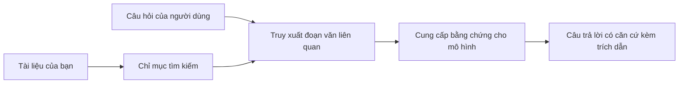

# Dạy AI Trả Lời Câu Hỏi Dựa Trên Tài Liệu Của Bạn:
## Phần 1: RAG, Azure so với Các Lựa Chọn Mã Nguồn Mở, và Khi Nào Việc Tinh Chỉnh Thực Sự Có Ý Nghĩa

> Bài viết đầu tiên trong chuỗi năm 2026 xem lại loạt hướng dẫn QA tài liệu Azure AI Search + Azure OpenAI năm 2023 của tôi.

## 1. Giới Thiệu - Xem Lại Hướng Dẫn RAG Trước Đây

Năm 2023, tôi đã làm một cặp hướng dẫn về cách dạy ChatGPT trả lời câu hỏi từ tài liệu PDF sử dụng Azure AI Search và Azure OpenAI. Tôi viết [phiên bản LangChain](https://techcommunity.microsoft.com/blog/educatordeveloperblog/teach-chatgpt-to-answer-questions-using-azure-ai-search--azure-openai-lang-chain/3969713), và tôi cũng đồng tác giả phiên bản [Semantic Kernel](https://techcommunity.microsoft.com/blog/educatordeveloperblog/teach-chatgpt-to-answer-questions-using-azure-ai-search--azure-openai-semantic-k/3985395) cùng [Lee Stott](https://developer.microsoft.com/en-us/advocates/lee-stott), một Quản Lý Đại Diện Cloud Cao Cấp tại Microsoft. Lúc đó, ý tưởng "ChatGPT trên dữ liệu của bạn" vẫn còn mới mẻ với nhiều nhà phát triển. Các hướng dẫn sử dụng Azure Blob Storage, Azure AI Search, Azure OpenAI, LangChain, Semantic Kernel, và FAISS-style vector retrieval để trả lời câu hỏi từ các file PDF.

Bài viết trước tập trung vào một quy trình đơn giản nhưng quan trọng: tải tài liệu lên, đánh chỉ mục, truy xuất nội dung liên quan, và yêu cầu mô hình trả lời dựa trên nội dung đó.

Năm 2026, hệ sinh thái RAG đã phát triển đáng kể. Azure AI Search giờ hỗ trợ các mẫu truy xuất vector và lai hiện đại, Azure OpenAI là một phần của hệ sinh thái Microsoft Foundry Models rộng lớn hơn, và API v1 mới có thể sử dụng client OpenAI chuẩn mà không cần thay đổi `api-version` hàng tháng. Đồng thời, các lựa chọn mã nguồn mở như LangGraph, LlamaIndex, Haystack, Qdrant, Milvus, Weaviate, Chroma, Ollama và vLLM trở thành các lựa chọn thực tế cho hệ thống RAG thật sự.

Đó là lý do tôi muốn xem lại chủ đề này. Câu hỏi không còn là "Làm sao để xây dựng RAG?" nữa. Giờ có nhiều cách xây dựng, câu hỏi quan trọng hơn là "Kiến trúc nào tôi nên chọn cho trường hợp của mình?"

Nhưng vấn đề cốt lõi vẫn không thay đổi.

Mô hình AI không tự động biết tài liệu của bạn. Để xây dựng hệ thống hỏi đáp tài liệu hữu ích, bạn vẫn cần các quy trình truy xuất, định vị, đánh giá và vận hành đáng tin cậy.

Bài viết này không phải là hướng dẫn "chat với PDF" toàn diện khác. Tôi muốn bắt đầu chuỗi cập nhật này với câu hỏi mà tôi quan tâm hơn: khi nào bạn nên chọn kiến trúc Azure quản lý, khi nào nên chọn stack RAG mã nguồn mở, và khi nào việc tinh chỉnh thực sự có ý nghĩa?

Đây là bài viết đầu tiên trong chuỗi về xây dựng hệ thống AI dựa trên tài liệu. Phần đầu tiên này chúng ta sẽ tập trung vào quyết định kiến trúc: tại sao RAG quan trọng, khi nào dịch vụ Azure quản lý hữu ích, khi nào các lựa chọn mã nguồn mở có lý, và vị trí của việc tinh chỉnh.

Sau khi xây dựng và xem lại các hệ thống QA tài liệu, tôi ít quan tâm việc công cụ nào trông đẹp trong demo hơn, mà tập trung hơn vào kiến trúc nào tồn tại được với người dùng thực, tài liệu thay đổi, quyền truy cập, sự cố và bảo trì.

## 2. Tại Sao AI Của Bạn Cần Hệ Thống Tìm Kiếm

Các mô hình ngôn ngữ lớn được huấn luyện trên dữ liệu công khai rộng rãi và dữ liệu có bản quyền. Chúng có thể biết nhiều về các chủ đề chung, nhưng không tự động biết các PDF riêng tư, chính sách nội bộ, quy trình doanh nghiệp, kho lưu trữ nghiên cứu, tài liệu giảng dạy, ghi chú hỗ trợ khách hàng hay tài liệu mới cập nhật của bạn.

Cách đơn giản để hiểu RAG là thế này: thay vì mong mô hình nhớ hết mọi tài liệu, chúng ta đưa cho nó hệ thống tìm kiếm. Khi người dùng đặt câu hỏi, hệ thống tìm các phần thông tin liên quan nhất, rồi cung cấp các phần đó cho mô hình như ngữ cảnh.

Điều này quan trọng vì nhiều nguồn kiến thức thực tế là riêng tư, thay đổi liên tục, nhạy cảm về quyền truy cập, lưu trữ trên nhiều hệ thống khác nhau, viết theo nhiều định dạng, và quá lớn để dán trực tiếp vào prompt.

Ví dụ, nếu một trường học, công ty hoặc nhóm nghiên cứu có 10.000 tài liệu nội bộ, mô hình không thể trả lời đáng tin cậy từ tài liệu đó nếu hệ thống không truy xuất đúng phần đúng lúc.

Điều này dẫn đến một câu hỏi phổ biến:

Tại sao không tinh chỉnh mô hình luôn?

Tinh chỉnh có thể hữu ích, nhưng thường không phải công cụ đầu tiên đúng cho kiến thức tài liệu. Nếu kiến thức thay đổi thường xuyên, nếu cần trích dẫn, hoặc có yêu cầu quyền truy cập, RAG thường là điểm khởi đầu tốt hơn. Tinh chỉnh thích hợp hơn cho việc dạy hành vi, phong cách, định dạng đầu ra, và mẫu tác vụ.

## 3. Kiến Trúc RAG Trong Thực Tiễn

Hãy tưởng tượng bạn đang xây dựng trợ lý AI cho một trường học. Trợ lý cần trả lời câu hỏi từ các PDF chính sách, hướng dẫn khóa học, trang FAQ nội bộ và thông báo cập nhật gần đây.

Nếu học sinh hỏi, "Tôi có thể sử dụng AI sinh văn bản cho bài tập cuối kỳ không?", hệ thống không nên trả lời dựa vào trí nhớ chung của mô hình. Nó nên tìm chính sách trường liên quan, truy xuất phần về việc sử dụng AI, rồi yêu cầu mô hình trả lời dựa trên bằng chứng đó.

Đó là RAG trong thực hành.

Ở mức độ cao, bạn có thể nghĩ luồng này như sau:

Chi tiết có thể phức tạp hơn, nhưng ý tưởng cơ bản đơn giản: mô hình không trả lời một mình. Nó trả lời kèm theo bằng chứng đã truy xuất.

Đầu tiên, tài liệu được lấy từ các hệ thống lưu trữ như Azure Blob Storage, SharePoint, GitHub, hoặc CMS nội bộ. Sau đó hệ thống phân tích chúng thành văn bản trong khi giữ nguyên cấu trúc hữu ích như tiêu đề, số trang, bảng biểu, mục lục, và vị trí nguồn.

Tiếp theo, nội dung được chia thành các đoạn nhỏ. Bước này nghe có vẻ đơn giản, nhưng là một phần quan trọng của hệ thống. Nếu đoạn quá nhỏ, có thể mất ngữ cảnh xung quanh. Nếu quá lớn, có thể chứa thông tin không liên quan và làm giảm độ chính xác truy xuất.

Sau khi chia nhỏ, hệ thống tạo các vector embedding và lưu vào chỉ mục có thể tìm kiếm cùng với văn bản gốc và metadata như tên file, số trang, quyền truy cập, phiên bản tài liệu và URL nguồn.

Khi người dùng đặt câu hỏi, hệ thống truy xuất các đoạn ứng viên dùng tìm kiếm từ khóa, vector hoặc lai. Một bộ tổ chức lại (reranker) có thể sắp xếp lại các đoạn để phần bằng chứng hữu ích nhất được lên đầu.

Cuối cùng, mô hình nhận câu hỏi cùng bằng chứng truy xuất. Câu trả lời nên được dựa trên bằng chứng đó và trả về trích dẫn để người dùng có thể kiểm tra nguồn.

Điểm quan trọng là RAG không chỉ là "đưa PDF vào cơ sở dữ liệu vector". Chất lượng câu trả lời phụ thuộc vào toàn bộ quy trình: phân tích, chia đoạn, truy xuất, sắp xếp lại, tạo prompt, trích dẫn và đánh giá.

Đó là lý do cấu trúc tài liệu rất quan trọng. Trong PDF, một tiêu đề, bảng biểu, chú thích chân trang, hay giới hạn trang có thể thay đổi nghĩa của đoạn văn. Trên Azure, kỹ năng Document Layout sử dụng năng lực bố cục Azure Document Intelligence để tạo ra đầu ra nhận biết cấu trúc, giúp cải thiện chất lượng chia đoạn và truy xuất cho hệ thống RAG.

## 4. Có Gì Thay Đổi Kể Từ 2023?

Hướng dẫn 2023 là điểm khởi đầu tốt cho thời điểm đó:

- Azure Blob Storage lưu trữ file PDF.
- Azure AI Search đánh chỉ mục nội dung.
- LangChain kết nối truy xuất với Azure OpenAI.
- FAISS hoạt động như cửa hàng vector địa phương đơn giản.
- Ví dụ sử dụng `gpt-35-turbo` và `text-embedding-ada-002`.

Năm 2026, phiên bản hiện đại nên phản ánh một số thay đổi.

Đầu tiên, truy xuất đã trưởng thành hơn. Năm 2023, nhiều demo dùng tìm kiếm tương đồng vector đơn giản. Nay, truy xuất lai thường là điểm bắt đầu mặc định cho QA tài liệu nghiêm túc. Azure AI Search hỗ trợ tìm kiếm lai bằng cách kết hợp truy vấn từ khóa và vector trong cùng một yêu cầu và gộp kết quả bằng Reciprocal Rank Fusion. Bộ xếp hạng Semantic có thể sắp xếp lại phần văn bản của kết quả đầy đủ văn bản, vector và lai.

Thứ hai, xử lý tài liệu phức tạp hơn. Thay vì tách từng tài liệu thủ công bằng mã ứng dụng, Azure AI Search hỗ trợ tích hợp vector hóa cho chia đoạn, embedding, và vector hóa truy vấn thời gian thực. Với PDF và workload nặng tài liệu, kỹ năng Document Layout giữ nhiều cấu trúc hơn so với đoạn cứng kích thước cố định.

Thứ ba, điều phối quan trọng hơn. Phần khó thường không phải là gọi API LLM. Phần khó là xử lý lỗi, thử lại, truy xuất lỗi thời, chất lượng đoạn, workflow dài, đánh giá con người và giám sát quy mô lớn. Đây là nơi các công cụ định hướng workflow như LangGraph, workflow LlamaIndex, pipeline Haystack và công cụ đánh giá, quan sát ở cấp nền tảng trở nên quan trọng hơn chuỗi tuyến tính đơn lẻ.

Thứ tư, đánh giá không còn là tùy chọn. Một demo có thể ấn tượng với một câu hỏi. Hệ thống sản xuất cần bộ test, kiểm tra hồi quy, chỉ số truy xuất, kiểm tra nền tảng, và giám sát. Không đánh giá thì khó biết hệ thống tiến bộ hay chỉ thay đổi.

## 5. Chọn Giữa Azure và Các Stack RAG Mã Nguồn Mở

Tôi không nghĩ câu hỏi hợp lý là "Azure có tốt hơn mã nguồn mở không?" hay "Mã nguồn mở có tốt hơn Azure không?"

Câu hỏi hữu ích là: bạn xây dựng hệ thống gì, ai vận hành, giới hạn và chế độ lỗi nào là không chấp nhận được?

Khi bắt đầu làm ví dụ QA tài liệu, tôi chủ yếu nghĩ xem truy xuất có hoạt động không. Tôi có thể tải PDF lên, tìm kiếm và tạo câu trả lời không? Đó là điểm khởi đầu hợp lý.

Sau khi trải nghiệm các workflow AI thực tế hơn, đánh giá của tôi thay đổi. Tôi giờ xem xét bốn điểm trước khi chọn stack RAG:

- danh tính và quyền truy cập
- chất lượng truy xuất
- độ tin cậy workflow
- quyền sở hữu vận hành

Bốn lĩnh vực đó cho bạn nhiều thông tin hơn chỉ benchmark mô hình.

Kiến trúc Azure thường hợp lý khi tích hợp doanh nghiệp là phần khó. Nếu nhóm đã dựa vào Microsoft Entra ID, Microsoft 365, Azure Storage, mạng riêng, RBAC và giám sát Azure, Azure AI Search cùng Azure OpenAI giảm bớt nhiều phức tạp vận hành. Trong môi trường đó, Azure không chỉ là API mô hình. Giá trị là hệ thống xung quanh: danh tính, quản trị, tìm kiếm quản lý, tích hợp bảo mật, hỗ trợ và vận hành quen thuộc.

Kiến trúc mã nguồn mở thường hợp lý khi tính linh hoạt là phần khó. Nếu nhóm cần suy luận tại chỗ, di động đám mây, pipeline truy xuất tùy chỉnh, sắp xếp lại đặc thù hoặc kiểm soát trực tiếp cơ sở dữ liệu vector và lớp phục vụ mô hình, stack mã nguồn mở có thể phù hợp hơn. Đổi lại, nhóm sở hữu nhiều công việc tin cậy hơn: sao lưu, mở rộng, độ trễ, di cư, giám sát và bảo mật.

Thực tế, nhiều hệ thống AI sản xuất không hoàn toàn cloud-native hoặc hoàn toàn mã nguồn mở. Thường là hệ thống lai cân bằng sự đơn giản vận hành, tính di động, quản trị và linh hoạt kỹ thuật.

Ví dụ, tôi không ngạc nhiên khi thấy hệ thống dùng Azure OpenAI để truy cập mô hình, LangGraph điều phối workflow, Azure hosting triển khai và cơ sở dữ liệu vector mã nguồn mở cho yêu cầu truy xuất đặc thù. Điều đó không phải là kiến trúc không nhất quán. Đó là chọn mức dịch vụ quản lý và kiểm soát kỹ thuật phù hợp cho từng phần của hệ thống.

Tôi thích kiến trúc lai khi nền tảng quản lý giải quyết vấn đề doanh nghiệp quan trọng, trong khi thành phần mã nguồn mở mang lại sự linh hoạt thực sự cần thiết cho nhóm.

## 6. Hướng Dẫn Quyết Định Thực Tiễn

Dưới đây là bảng quyết định tôi sẽ dùng với nhóm trước khi chọn stack RAG:

| Lĩnh vực quyết định | Stack Azure quản lý mạnh hơn khi... | Stack mã nguồn mở mạnh hơn khi... |
| --- | --- | --- |
| Danh tính và truy cập | Entra ID, RBAC, danh tính quản lý, và quyền doanh nghiệp là trung tâm | xác thực tùy chỉnh, danh tính không phải Microsoft hoặc logic truy cập ứng dụng chiếm ưu thế |
| Vận hành | nhóm muốn hạ tầng quản lý, hỗ trợ, SLA và onboarding đơn giản hơn | nhóm vận hành cơ sở dữ liệu vector, phục vụ mô hình, sao lưu và mở rộng |
| Truy xuất | tìm kiếm lai, xếp hạng ngữ nghĩa, bộ lọc và tìm kiếm metadata đáp ứng phần lớn nhu cầu | nhóm cần truy xuất tùy chỉnh, sắp xếp lại chuyên biệt hoặc thử nghiệm đánh chỉ mục |
| Di động | hệ sinh thái Azure được chấp nhận hoặc ưu tiên | tránh khóa cloud (cloud lock-in) là yêu cầu bắt buộc |
| Suy luận | quản trị Azure OpenAI, mạng và kiểm soát doanh nghiệp quan trọng | suy luận tại chỗ, mô hình tùy chỉnh hoặc phục vụ tự chủ được yêu cầu |
| Chi phí | giảm công sức kỹ thuật và vận hành quan trọng hơn tối ưu hạ tầng | quy mô đủ lớn để biện minh cho tối ưu hạ tầng kỹ càng |
| Thử nghiệm | ổn định và tích hợp doanh nghiệp quan trọng hơn thay đổi thường xuyên | nhóm lặp nhanh trên agent, công cụ, bộ nhớ, và workflow truy xuất |

Quy tắc chung của tôi rất đơn giản:

- Bắt đầu với Azure khi tích hợp doanh nghiệp, bảo mật, và đơn giản vận hành là rủi ro chính.
- Bắt đầu với mã nguồn mở khi tính di động, tùy chỉnh hay kiểm soát tại chỗ là rủi ro chính.
- Dùng stack lai khi cả hai đều đúng.

Đó cũng là lý do tôi không bắt đầu chuỗi RAG năm 2026 với code trước. Code quan trọng, nhưng chọn kiến trúc mới là bước trước triển khai. Demo đơn giản có thể che giấu các lựa chọn khó. Hệ thống RAG tốt làm rõ các lựa chọn đó.

## 7. Vị Trí Của Việc Tinh Chỉnh

Tinh chỉnh thường được nhắc đến cùng với RAG, nhưng tôi nghĩ cần tách biệt hai việc này.

RAG thường là lựa chọn tốt hơn khi hệ thống cần kiến thức mới, riêng tư, nhạy cảm về quyền truy cập, hoặc dựa trên nguồn gốc. Nếu câu trả lời cần trích dẫn tài liệu, phản ánh cập nhật gần đây, hoặc tôn trọng luật truy cập cụ thể người dùng, truy xuất nên nằm trong kiến trúc.

Tinh chỉnh hữu ích hơn khi kiến thức không phải là vấn đề chính. Nó giúp khi bạn muốn mô hình tuân theo định dạng đầu ra cụ thể, phù hợp phong cách đáp ứng theo lĩnh vực, thực hiện ổn định công việc đều đặn hơn, hoặc giảm lượng chỉ dẫn cần thiết trong mỗi prompt.
Trong thực tế, hai phương pháp có thể hoạt động cùng nhau. Một trợ lý hỗ trợ có thể sử dụng RAG để truy xuất chính sách mới nhất, trong khi một mô hình được tinh chỉnh học được cấu trúc câu trả lời và giọng điệu ưa thích của công ty.

Sai lầm là xem việc tinh chỉnh như một sự thay thế cho kho tài liệu. Nó không loại bỏ nhu cầu truy xuất khi hệ thống phải trả lời từ dữ liệu mới, riêng tư hoặc nhạy cảm về quyền truy cập.

## 8. Phần tiếp theo của chuỗi bài này

Bài viết này là lớp quyết định. Trước khi viết mã, tôi muốn làm rõ các đánh đổi: RAG so với tinh chỉnh, Azure so với mã nguồn mở, dịch vụ quản lý so với kiểm soát vận hành.

Trước khi tiến hành triển khai, tôi muốn để lại một điểm ở đây: trong nhiều hệ thống AI doanh nghiệp, mô hình chỉ là một thành phần. Chất lượng truy xuất, điều phối, đánh giá, quyền truy cập, và độ tin cậy vận hành thường là những yếu tố quyết định liệu hệ thống có thành công vượt qua giai đoạn trình diễn hay không.

Trong các phần tiếp theo của chuỗi này, tôi dự định đi sâu hơn vào phần thực tiễn của các hệ thống AI dựa trên tài liệu: cách xây dựng kiến trúc dựa trên Azure, cách các lựa chọn mã nguồn mở so sánh trong thực tế, và cách đánh giá liệu hệ thống RAG có thực sự hoạt động.

Tôi có thể điều chỉnh thứ tự khi chuỗi phát triển, nhưng mục tiêu sẽ giữ nguyên: vượt qua một bản trình diễn đơn giản và cho thấy cách suy nghĩ về các hệ thống RAG có thể được duy trì, đánh giá và vận hành.

## 9. Tài liệu tham khảo và nguồn lực

Các bài hướng dẫn gốc:

- [Dạy ChatGPT trả lời câu hỏi: Sử dụng Azure AI Search & Azure OpenAI (Lang Chain)](https://techcommunity.microsoft.com/blog/educatordeveloperblog/teach-chatgpt-to-answer-questions-using-azure-ai-search--azure-openai-lang-chain/3969713)
- [Dạy ChatGPT trả lời câu hỏi: Sử dụng Azure AI Search & Azure OpenAI (Semantic Kernel)](https://techcommunity.microsoft.com/blog/educatordeveloperblog/teach-chatgpt-to-answer-questions-using-azure-ai-search--azure-openai-semantic-k/3985395)

Azure:

- [Phiên bản REST API Azure AI Search](https://learn.microsoft.com/en-us/rest/api/searchservice/search-service-api-versions)
- [Tìm kiếm kết hợp trong Azure AI Search](https://learn.microsoft.com/en-us/azure/search/hybrid-search-how-to-query)
- [Vector hóa tích hợp trong Azure AI Search](https://learn.microsoft.com/en-us/azure/search/vector-search-integrated-vectorization)
- [Kỹ năng Bố cục Tài liệu trong Azure AI Search](https://learn.microsoft.com/en-us/azure/search/cognitive-search-skill-document-intelligence-layout)
- [Chia nhỏ và vector hóa theo bố cục tài liệu](https://learn.microsoft.com/en-us/azure/search/search-how-to-semantic-chunking)
- [Xếp hạng ngữ nghĩa trong Azure AI Search](https://learn.microsoft.com/en-us/azure/search/semantic-search-overview)
- [Vòng đời phiên bản API Azure OpenAI / Microsoft Foundry](https://learn.microsoft.com/en-us/azure/foundry/openai/api-version-lifecycle)
- [Mô hình Foundry được Azure bán trực tiếp](https://learn.microsoft.com/en-us/azure/foundry/foundry-models/concepts/models-sold-directly-by-azure)
- [Xem xét tinh chỉnh Microsoft Foundry](https://learn.microsoft.com/en-us/azure/foundry/openai/concepts/fine-tuning-considerations)
- [Khả năng quan sát Microsoft Foundry](https://learn.microsoft.com/en-us/azure/foundry/concepts/observability)
- [Chạy đánh giá trong Microsoft Foundry](https://learn.microsoft.com/en-us/azure/foundry/how-to/evaluate-generative-ai-app)

Mã nguồn mở:

- [Tài liệu LangGraph](https://docs.langchain.com/oss/python/langgraph/overview)
- [Tài liệu LlamaIndex](https://developers.llamaindex.ai/python/framework/)
- [Tài liệu Haystack](https://docs.haystack.deepset.ai/)
- [Tài liệu Qdrant](https://qdrant.tech/documentation/overview/)
- [Tài liệu Milvus](https://milvus.io/docs/overview.md)
- [Tài liệu Weaviate](https://docs.weaviate.io/weaviate/current/)
- [Tài liệu Chroma](https://docs.trychroma.com/docs/overview/introduction)
- [Ollama embeddings](https://docs.ollama.com/capabilities/embeddings)
- [Máy chủ tương thích OpenAI vLLM](https://docs.vllm.ai/en/latest/serving/openai_compatible_server.html)
- [Mô hình nhúng BGE](https://huggingface.co/BAAI/bge-large-en-v1.5)
- [Mô hình nhúng E5](https://huggingface.co/intfloat/e5-large-v2)
- [Mô hình nhúng Instructor](https://huggingface.co/hkunlp/instructor-large)

---

<!-- CO-OP TRANSLATOR DISCLAIMER START -->
**Tuyên bố miễn trừ trách nhiệm**:
Tài liệu này đã được dịch bằng dịch vụ dịch thuật AI [Co-op Translator](https://github.com/Azure/co-op-translator). Mặc dù chúng tôi cố gắng đảm bảo độ chính xác, xin lưu ý rằng bản dịch tự động có thể chứa lỗi hoặc sai sót. Tài liệu gốc bằng ngôn ngữ gốc nên được coi là nguồn tin chính thức. Đối với thông tin quan trọng, nên sử dụng dịch vụ dịch thuật chuyên nghiệp bởi con người. Chúng tôi không chịu trách nhiệm về bất kỳ hiểu lầm hoặc giải thích sai nào phát sinh từ việc sử dụng bản dịch này.
<!-- CO-OP TRANSLATOR DISCLAIMER END -->