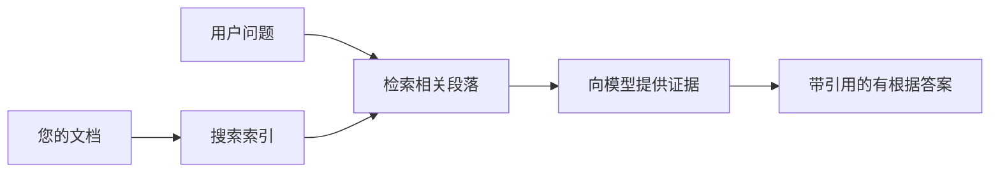

# 教 AI 根据您的文档回答问题：
## 系列 1：RAG、Azure 与开源替代方案，以及何时进行微调更合适

> 2026 年系列第一篇文章，回顾我在 2023 年发布的 Azure AI 搜索 + Azure OpenAI 文档问答教程。

系列导航：[代码库主页](../README.md) | 下一篇：[系列 2 - 端到端构建本地开源 RAG 系统](./series-2-open-source-rag-end-to-end.md)

## 1. 介绍 - 重访早期 RAG 教程

2023 年，我制作了两篇关于如何教 ChatGPT 利用 Azure AI 搜索和 Azure OpenAI 从 PDF 文档回答问题的教程。我写了[LangChain 版本](https://techcommunity.microsoft.com/blog/educatordeveloperblog/teach-chatgpt-to-answer-questions-using-azure-ai-search--azure-openai-lang-chain/3969713)，同时和微软首席云倡导经理 [Lee Stott](https://developer.microsoft.com/en-us/advocates/lee-stott) 合著了配套的[Semantic Kernel 版本](https://techcommunity.microsoft.com/blog/educatordeveloperblog/teach-chatgpt-to-answer-questions-using-azure-ai-search--azure-openai-semantic-k/3985395)。当时，“基于你的数据的 ChatGPT” 这个想法对许多开发者来说仍然很新。这些教程使用了 Azure Blob 存储、Azure AI 搜索、Azure OpenAI、LangChain、Semantic Kernel 和 FAISS 风格的向量检索来回答 PDF 文件中的问题。

那篇早期文章的重点是一个简单但重要的流程：上传文档、建立索引、检索相关内容，然后让模型基于这些内容回答。

到了 2026 年，RAG 生态系统有了重大增长。Azure AI 搜索现在支持现代向量和混合检索模式，Azure OpenAI 是更广泛微软 Foundry 模型生态的一部分，较新的 v1 API 支持使用标准 OpenAI 客户端，无需每月更改 `api-version`。与此同时，LangGraph、LlamaIndex、Haystack、Qdrant、Milvus、Weaviate、Chroma、Ollama 和 vLLM 等开源选项已经成为实际可用的 RAG 系统选择。

这就是我想重提这个话题的原因。问题不再是“我该如何构建 RAG？”，而是现在有很多方案，更重要的问题是“针对我的情况，应该选择哪种架构？”

但核心问题没有变。

AI 模型不会自动“知道”您的文档。要构建有用的文档问答系统，您仍然需要可靠的检索、信息溯源、评估和运营工作流。

本文不是另一篇端到端“聊天式 PDF”教程。我想从一个我现在更关心的问题开始这个更新系列：何时应该选择托管的 Azure 架构，何时应该选择开源 RAG 栈，何时真正应该进行微调？

这是一个关于构建基于文档的 AI 系统系列的第一篇文章。在这第一部分，我们将聚焦架构决策：为什么 RAG 重要，什么时候 Azure 托管服务有用，什么时候开源方案合适，以及微调在哪些场景中发挥作用。

在构建并重新审视文档问答系统之后，我现在更关心的不是哪个工具在演示中表现更好，而是哪个架构能经受真实用户、文档变化、权限管理、故障和维护的考验。

## 2. 为什么您的 AI 需要检索系统

大型语言模型训练于广泛的公共和授权数据。它们可能对一般话题了解很多，但并不自动知道您私有的 PDF、内部政策、企业流程、研究档案、课堂材料、客户支持记录或最新更新的文档。

一个简单的方式理解 RAG 是：我们不期望模型记住每个文档，而是给它一个检索系统。当用户提问时，系统首先找到最相关的信息片段，然后把这些片段作为上下文提供给模型。

这很重要，因为许多实际的知识来源是私有的，持续变化的，权限敏感的，分散存储在多个系统中，用多种格式写成，而且太庞大，不能直接粘贴进提示。

举例来说，如果一个学校、公司或研究团队拥有 10,000 份内部文档，模型无法可靠地从这些文档直接回答，除非系统能在适当时间检索出正确部分。

这自然引发一个常见问题：

为什么不直接微调模型？

微调是有用的，但通常不是文档知识的首选工具。如果知识经常变化、引用很重要或者访问权限关键，RAG 通常是更合适的起点。微调更适合教导行为风格、输出格式和任务模式。

## 3. RAG 架构实践

想象你为学校构建一个 AI 助手。助手需要回答政策 PDF、课程指南、内部 FAQ 页以及最新公告中的问题。

如果学生问“我能用生成式 AI 完成期末作业吗？”，系统不应直接从模型的一般记忆回答，而应先找到相关的校方政策，检索关于 AI 使用的条例，然后让模型基于这些证据回答。

这就是 RAG 的实际应用。

从宏观上看，流程大致如下：

细节可以更复杂，但核心思想很简单：模型不是单独回答，而是借助检索到的证据回答。

首先，文档从 Azure Blob 存储、SharePoint、GitHub 或内部内容管理系统等存储系统摄取。然后系统将它们解析为文本，并保留诸如标题、页码、表格、章节和来源位置等有用结构。

接下来，将内容切分成块。这看似简单，却是系统最重要的部分之一。如果块太小，可能丢失上下文；块太大，又可能带入无关信息，降低检索精度。

切分后，系统创建嵌入向量，并连同原始文本及元数据（如文件名、页码、权限、文档版本和来源 URL）一起存入可检索索引。

当用户发问时，系统通过关键字搜索、向量搜索或混合搜索检索备选块。再用重排序器将这些块重新排序，以便最有用的证据排到最前面。

最后，模型收到问题和检索到的证据。答案应基于这些证据，并带上引用，方便用户查验源头。

关键点是，RAG 不仅仅是“把 PDF 放入向量数据库”。答案质量依赖于整个流程：解析、切块、检索、重排序、提示、引证和评估。

这也是为什么文档结构很重要。在 PDF 中，标题、表格、脚注或分页符可能改变段落含义。Azure 上的 Document Layout 技能利用 Azure Document Intelligence 的布局能力生成结构感知结果，有助于提升 RAG 系统的切块和检索质量。

## 4. 自 2023 年以来有哪些变化？

2023 年教程在当时是个不错的起点：

- 使用 Azure Blob Storage 存储 PDF 文件。
- Azure AI 搜索建立内容索引。
- LangChain 连接检索和 Azure OpenAI。
- FAISS 作为简易本地向量库。
- 例子中采用 `gpt-35-turbo` 和 `text-embedding-ada-002`。

到了 2026 年，现代版本应反映若干变化。

首先，检索更成熟。2023 年很多演示仅用简单的向量相似度搜索。现在，混合检索往往是正式文档问答的默认起点。Azure AI 搜索支持混合搜索，可在单次请求中结合关键字和向量查询，并通过互惠秩融合（Reciprocal Rank Fusion）合并结果。语义排序器可对全文、向量和混合结果中的文本部分重新排序。

其次，摄取更智能。Azure AI 搜索支持集成向量化，用于切块、嵌入和查询时向量化，无需手动用应用代码切分每个文档。对于 PDF 和重文档负载，Document Layout 技能可以保留比固定大小切块更多的结构。

第三，编排更重要。难点通常不是 LLM API 调用本身，而是处理失败、重试、陈旧检索、块质量、长流程、人为复审和大规模评估。这时，面向工作流的工具如 LangGraph、LlamaIndex 工作流、Haystack 流水线以及平台层评估与可观测工具比单一线性链更有价值。

第四，评估不再可选。单问一题的演示可以很酷，生产系统需有测试集、回归检测、检索指标、溯源检查和监控。没有评估，很难知道系统是在改进还是仅仅在变化。

## 5. 在 Azure 和开源 RAG 方案间进行选择

我认为有用的问题不是“Azure 比开源好吗？”或“开源比 Azure 好吗？”

有用的问题是：你在构建什么样的系统？谁来操作？有什么限制？哪些失败模式是不可接受的？

刚开始做文档问答示例时，我主要关注检索是否成功。能否上传 PDF、搜索它们并生成答案？这是个合理的起点。

经过更现实的 AI 工作流实践，我的评估标准有所变化。现在选择 RAG 方案前，我看四个方面：

- 身份和权限
- 检索质量
- 工作流可靠性
- 运营所有权

这四点比单纯模型基准测试告诉你更多。

当企业集成是难点时，基于 Azure 的架构通常合适。如果团队已经依赖 Microsoft Entra ID、Microsoft 365、Azure 存储、私有网络、RBAC 和 Azure 监控，Azure AI 搜索和 Azure OpenAI 能简化很多运营复杂度。在这种环境中，Azure 不仅是模型 API，它的价值在于周边系统：身份、治理、托管搜索、安全集成、支持和熟悉的运维。

当灵活性是难点时，开源架构通常合适。如果团队需要本地推理、云可移植性、自定义检索流程、专项重排序，或直接控制向量数据库和模型服务层，开源栈可能更合适。代价是团队需要承担更多可靠性工作：备份、扩展、延迟、迁移、监控和安全。

实际上，很多生产 AI 系统既非纯云原生也非完全开源，而是混合系统，平衡运营简便性、可移植性、治理和工程灵活性。

举例来说，我不惊讶看到系统用 Azure OpenAI 做模型访问，LangGraph 做工作流编排，Azure 托管部署，用一个开源向量库满足某些检索需求。这不是架构不一致，而是为系统不同部分选择合适的托管服务和工程控制水平。

我喜欢混合架构：托管平台解决关键企业问题，开源组件提供关键场景中的灵活性。

## 6. 实用决策指南

这是我在和团队选 RAG 栈前会用的决策表：

| 决策领域 | 当...时 Azure 托管栈更强 | 当...时开源栈更强 |
| --- | --- | --- |
| 身份和访问 | 以 Entra ID、RBAC、受管身份和企业权限为中心 | 以自定义认证、非微软身份或应用特定访问逻辑为主导 |
| 运营 | 团队需要托管基础设施、支持、SLA 和简化上手 | 团队能运维向量库、模型服务、备份和扩展 |
| 检索 | 混合搜索、语义排序、筛选和元数据搜索覆盖大部分需求 | 团队需自定义检索、专项重排序或实验性索引 |
| 可移植性 | Azure 生态契合或优先 | 避免云锁定是硬性需求 |
| 推理 | Azure OpenAI 管理、网络和企业控制重要 | 本地推理、自定义模型或自托管服务必须 |
| 费用 | 降低工程运维工作量比基础设施调优更重要 | 规模足够大，值得进行精细基础设施优化 |
| 试验 | 稳定性和企业集成比频繁更换组件重要 | 团队快速迭代代理、工具、记忆和检索流程 |

我的经验法则很简单：

- 若企业集成、安全和运营简便是主要风险，先选 Azure。
- 若可移植性、定制或本地控制是核心，先选开源。
- 如果两者都重要，使用混合栈。

这也是为何我不会从代码开始写 2026 年的 RAG 系列。代码固然重要，但架构选择应该先于实现。简单的演示可能掩盖最难的选择。好的 RAG 系统让这些选择展露无遗。

## 7. 微调的定位

微调常和 RAG 一起提及，但我认为两者应区分开。

当系统需要新鲜、私密、权限敏感或源头溯源知识时，RAG 往往是更优选。如果答案应当引用文档、反映最近更新或遵守用户特定访问规则，检索应该是架构组成。

微调在知识不是主要问题时更有用。当您希望模型遵循特定的输出格式、匹配特定领域的响应风格、更稳定地执行某项任务，或减少每次提示中所需的指令时，微调都能提供帮助。

在实际应用中，两者可以协同工作。支持助手可能使用 RAG 来检索最新的政策，而微调模型则学习公司首选的答案结构和语气。

错误在于将微调视为文档存储的替代品。当系统必须从最新的、私有的或权限敏感的数据中回答时，仍然需要检索。

## 8. 本系列的下一步方向

本文是决策层。在编写代码之前，我想明确权衡：RAG 与微调，Azure 与开源，托管服务与操作控制。

在进入实现之前，我想这里强调一点：在许多企业级 AI 系统中，模型只是其中的一个组成部分。检索质量、编排、评估、权限和运行可靠性通常决定了系统是否能超越演示阶段取得成功。

在本系列的后续部分，我计划更深入地探讨文档驱动的 AI 系统的实操内容：首先构建本地开源 RAG 工作流，然后使用 Azure AI Search 和 Azure OpenAI 重新构建同样的场景，最后评估系统的实际效果。

随着系列的发展，我可能会调整顺序，但目标保持不变：超越简单演示，展示如何思考可维护、可评估和可运营的 RAG 系统。

## 9. 参考资料和资源

原始教程：

- [Teach ChatGPT to Answer Questions: Using Azure AI Search & Azure OpenAI (Lang Chain)](https://techcommunity.microsoft.com/blog/educatordeveloperblog/teach-chatgpt-to-answer-questions-using-azure-ai-search--azure-openai-lang-chain/3969713)
- [Teach ChatGPT to Answer Questions: Using Azure AI Search & Azure OpenAI (Semantic Kernel)](https://techcommunity.microsoft.com/blog/educatordeveloperblog/teach-chatgpt-to-answer-questions-using-azure-ai-search--azure-openai-semantic-k/3985395)

Azure：

- [Azure AI Search REST API versions](https://learn.microsoft.com/en-us/rest/api/searchservice/search-service-api-versions)
- [Hybrid search in Azure AI Search](https://learn.microsoft.com/en-us/azure/search/hybrid-search-how-to-query)
- [Integrated vectorization in Azure AI Search](https://learn.microsoft.com/en-us/azure/search/vector-search-integrated-vectorization)
- [Document Layout skill in Azure AI Search](https://learn.microsoft.com/en-us/azure/search/cognitive-search-skill-document-intelligence-layout)
- [Chunk and vectorize by document layout](https://learn.microsoft.com/en-us/azure/search/search-how-to-semantic-chunking)
- [Semantic ranking in Azure AI Search](https://learn.microsoft.com/en-us/azure/search/semantic-search-overview)
- [Azure OpenAI / Microsoft Foundry API version lifecycle](https://learn.microsoft.com/en-us/azure/foundry/openai/api-version-lifecycle)
- [Foundry Models sold by Azure](https://learn.microsoft.com/en-us/azure/foundry/foundry-models/concepts/models-sold-directly-by-azure)
- [Microsoft Foundry fine-tuning considerations](https://learn.microsoft.com/en-us/azure/foundry/openai/concepts/fine-tuning-considerations)
- [Microsoft Foundry observability](https://learn.microsoft.com/en-us/azure/foundry/concepts/observability)
- [Run evaluations in Microsoft Foundry](https://learn.microsoft.com/en-us/azure/foundry/how-to/evaluate-generative-ai-app)

开源：

- [LangGraph documentation](https://docs.langchain.com/oss/python/langgraph/overview)
- [LlamaIndex documentation](https://developers.llamaindex.ai/python/framework/)
- [Haystack documentation](https://docs.haystack.deepset.ai/)
- [Qdrant documentation](https://qdrant.tech/documentation/overview/)
- [Milvus documentation](https://milvus.io/docs/overview.md)
- [Weaviate documentation](https://docs.weaviate.io/weaviate/current/)
- [Chroma documentation](https://docs.trychroma.com/docs/overview/introduction)
- [Ollama embeddings](https://docs.ollama.com/capabilities/embeddings)
- [vLLM OpenAI-compatible server](https://docs.vllm.ai/en/latest/serving/openai_compatible_server.html)
- [BGE embedding models](https://huggingface.co/BAAI/bge-large-en-v1.5)
- [E5 embedding models](https://huggingface.co/intfloat/e5-large-v2)
- [Instructor embedding models](https://huggingface.co/hkunlp/instructor-large)

下一篇：[系列 2 - 构建本地开源 RAG 系统端到端](./series-2-open-source-rag-end-to-end.md)

---

<!-- CO-OP TRANSLATOR DISCLAIMER START -->
**免责声明**：
本文件由 AI 翻译服务 [Co-op Translator](https://github.com/Azure/co-op-translator) 翻译完成。尽管我们力求准确，但请注意，自动翻译可能包含错误或不准确之处。原始语言版文件应视为权威来源。对于重要信息，建议使用专业人工翻译。我们对因使用本翻译而产生的任何误解或误释不承担责任。
<!-- CO-OP TRANSLATOR DISCLAIMER END -->