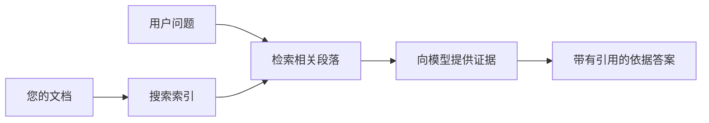

# 教AI根据您的文档回答问题：
## 系列1：RAG，Azure与开源替代方案，以及何时进行微调才有意义

> 2026年系列中的第一篇文章，回顾我2023年关于Azure AI Search + Azure OpenAI文档问答的教程。

## 1. 引言 - 重访早期的RAG教程

2023年，我制作了一对关于教ChatGPT使用Azure AI Search和Azure OpenAI从PDF文档回答问题的教程。我写了[LangChain版本](https://techcommunity.microsoft.com/blog/educatordeveloperblog/teach-chatgpt-to-answer-questions-using-azure-ai-search--azure-openai-lang-chain/3969713)，并与微软首席云倡导经理[Lee Stott](https://developer.microsoft.com/en-us/advocates/lee-stott)共同撰写了伴随的[Semantic Kernel版本](https://techcommunity.microsoft.com/blog/educatordeveloperblog/teach-chatgpt-to-answer-questions-using-azure-ai-search--azure-openai-semantic-k/3985395)。当时，“基于您的数据使用ChatGPT”的理念对许多开发者来说仍然很新。教程使用Azure Blob存储、Azure AI Search、Azure OpenAI、LangChain、Semantic Kernel和FAISS类型的向量检索技术，从PDF文件中回答问题。

早期文章聚焦于一个简单但重要的工作流程：上传文档，索引文档，检索相关内容，然后基于该内容让模型回答问题。

到了2026年，RAG生态系统显著发展。Azure AI Search现已支持现代的向量和混合检索模式，Azure OpenAI融入了微软Foundry Models更宽广的生态系统，新的v1 API可以使用标准OpenAI客户端，无需每月更改`api-version`。同时，开源选项如LangGraph、LlamaIndex、Haystack、Qdrant、Milvus、Weaviate、Chroma、Ollama和vLLM已成为实际RAG系统的可行选择。

这就是我想重新探讨该主题的原因。问题不再只是“如何构建RAG？”现在有许多构建方式，更重要的问题是“我应该为我的情况选择哪种架构？”

但核心问题未变。

AI模型并不会自动“知道”您的文档。要构建有用的文档问答系统，您仍然需要可靠的检索、依据、评估和运维工作流程。

本文不是另一篇关于“和PDF聊天”的端到端教程。我想用我现在更关心的问题开始本更新系列：什么时候应该选择托管的Azure架构，什么时候选择开源RAG堆栈，什么时候微调才真正有意义？

这是关于构建以文档为基础的AI系统系列的第一篇。在本部分，我们将聚焦架构决策：为什么RAG重要，什么时候Azure托管服务有用，什么时候开源替代方案合适，以及微调的位置。

在构建和回顾文档问答系统后，我对演示中哪个工具更好看兴趣减退，更关注哪个架构能应对真实用户、变化的文档、权限、失败和维护。

## 2. 为什么您的AI需要搜索系统

大型语言模型训练于广泛的公开和授权数据。它们可能对通用话题了解很多，但不会自动知道您的私有PDF、内部政策、企业流程、研究档案、课堂材料、客户支持笔记或最近更新的文档。

理解RAG的简单方式是：我们不期望模型记住每个文档，而是给它一个搜索系统。当用户提问时，系统先找到最相关的信息片段，再将这些片段作为上下文提供给模型。

这很重要，因为许多现实世界的知识源是私有的、不断变化的、权限敏感的，分布在多个系统中、格式多样，且内容太大，无法直接粘贴到提示中。

例如，如果一所学校、公司或研究团队有10,000份内部文档，模型如果没有系统及时检索正确部分，是无法可靠回答问题的。

这自然引出一个常见问题：

为什么不直接微调模型呢？

微调确实有用，但通常不是文档知识的首选工具。如果知识频繁变更、引用很重要或访问权限有要求，RAG通常是更好的起点。微调更适合教模型行为、风格、输出格式和任务模式。

## 3. RAG架构实战

想象您正在为学校构建一个AI助手。助手需要回答来自政策PDF、课程指南、内部FAQ页面和最近更新公告的问题。

比如学生问：“我能用生成式AI来完成期末作业吗？”系统不该仅从模型的通用记忆中回答，而应先找到相关的学校政策，检索其中关于AI使用的部分，再让模型用这些证据回答。

这就是实践中的RAG。

从高层看，流程可以这样理解：

细节可以更复杂，但基本思路很简单：模型不是孤立回答，而是结合检索来的证据回答。

首先，文档从Azure Blob Storage、SharePoint、GitHub或内部CMS等存储系统摄取。然后系统解析成文本，同时保留有用结构如标题、页码、表格、区段和来源位置。

接下来，内容被拆分成块。看似简单，这步非常重要。如果块太小，可能丢失上下文；块太大，则可能包含无关信息，降低检索精度。

拆分完成后，系统生成嵌入向量并将其与原文和元数据（如文件名、页码、权限、文档版本和源URL）存入可检索索引。

用户提问时，系统用关键词搜索、向量搜索或混合搜索检索备选块。随后可用重排序器，将最有用的证据提升到顶部。

最后，模型接收问题和检索到的证据。答案应以证据为基础，并返回引用出处，方便用户核查。

关键是，RAG不仅仅是“把PDF放进向量数据库”。答案质量依赖整个工作流程：解析、拆分、检索、重排、提示、引用和评估。

这就是为什么文档结构重要。在PDF中，标题、表格、脚注或分页边界都可能改变语义。Azure的Document Layout技能利用Azure Document Intelligence的布局能力生成结构感知的输出，可提升RAG系统的拆分和检索质量。

## 4. 自2023年以来发生了什么变化？

2023年的教程当时是良好起点：

- Azure Blob Storage存储PDF文件。
- Azure AI Search索引内容。
- LangChain连接检索与Azure OpenAI。
- FAISS充当简单的本地向量存储。
- 示例使用了`gpt-35-turbo`和`text-embedding-ada-002`。

到了2026年，现代版本应反映多个变化。

首先，检索技术成熟。2023年很多演示只用简单的向量相似度搜索，而现在混合检索是严肃文档问答的默认起点。Azure AI Search支持将关键词和向量查询合并在单次请求中，并用倒数秩融合（Reciprocal Rank Fusion）合并结果。语义排序器随后可对全文、向量和混合结果中的文本部分重排。

其次，摄取更复杂。Azure AI Search支持集成向量化功能进行拆分、嵌入和查询时向量化，无需每篇文档用代码手动拆分。对于PDF和文档密集的工作负载，Document Layout技能可比固定块大小保留更多结构信息。

第三，编排更重要。难点往往不在LLM API调用，而是处理失败、重试、过期检索、块质量、长流程、人工审查和规模化评估等。这时，用LangGraph、LlamaIndex工作流、Haystack流水线以及平台级别评估和观察工具比单一线性链更相关。

第四，评估不再可选。演示中一个问题可能看起来很棒，生产系统需要测试集、回归检测、检索指标、依据检查和监控。没有评估，很难判断系统是进步还是仅仅变化。

## 5. 如何在Azure和开源RAG堆栈间选择

我认为有用的问题不是“Azure比开源更好吗？”或“开源比Azure更好吗？”。

关键是：您构建什么系统，谁来运营，有哪些约束，哪些失败模式是不可接受的？

开始做文档问答示例时，我大多关注检索是否有效。能否上传PDF，搜索它们，生成答案？这是合理的起点。

经过更现实的AI工作流后，我的评估变了。现在选RAG堆栈前，我看看四个方面：

- 身份和权限  
- 检索质量  
- 工作流可靠性  
- 运维归属  

这四点告诉您的远比模型基准单一指标更多。

企业集成是难点时，基于Azure的架构通常更合适。如果团队已依赖Microsoft Entra ID、Microsoft 365、Azure存储、私有网络、RBAC和Azure监控，Azure AI Search和Azure OpenAI能大幅简化运维复杂度。在那环境中，Azure不只是模型API，价值是周边系统：身份、治理、托管搜索、安全集成、支持和熟悉操作。

灵活性是难点时，开源架构通常更合适。如果团队需要本地推理、云可移植性、自定义检索管道、专用重排序或直接掌控向量数据库和模型服务层，开源堆栈是更佳选择。代价是团队承担更多的可靠性工作：备份、扩展、延迟、迁移、监控和安全。

实际中，许多生产AI系统既非纯云原生也非纯开源。它们常是混合系统，平衡运维简化、可移植性、治理和工程灵活性。

例如，我不意外一个系统会用Azure OpenAI作模型访问，LangGraph做工作流编排，Azure托管部署，并用开源向量数据库满足某特殊检索需求。这不是架构不一致，而是为系统各部分选对托管服务与工程控制的恰当层级。

我喜欢混合架构，因托管平台解决了重要企业问题，开源组件则在真正重要的地方给团队灵活性。

## 6. 实用决策指南

以下是我在选RAG堆栈前会和团队一起用的决策表：

| 决策领域 | 当...时Azure托管堆栈更有优势 | 当...时开源堆栈更有优势 |
| --- | --- | --- |
| 身份与访问 | Entra ID、RBAC、托管身份及企业权限是核心 | 自定义认证、非微软身份或应用专属访问逻辑是主导 |
| 运维 | 团队想要托管基础设施、支持、SLA和更简单的上手 | 团队能运营向量数据库、模型服务、备份和扩容 |
| 检索 | 混合搜索、语义排序、筛选和元数据搜索满足大多数需求 | 团队需要自定义检索、专用重排或试验性索引 |
| 可移植性 | 接受或偏好Azure生态系统 | 规避云锁定是刚性需求 |
| 推理 | Azure OpenAI治理、网络和企业控制重要 | 需要本地推理、自定义模型或自托管服务 |
| 成本 | 降低工程和运维工作比基础设施调优更重要 | 规模足够大值得精细基础设施优化 |
| 试验 | 稳定性和企业集成比频繁更换组件更重要 | 团队快速迭代代理、工具、记忆和检索工作流 |

我的经验法则很简单：

- 当企业集成、安全和运维简化是主要风险时，从Azure开始。
- 当可移植性、自定义或本地控制是主要风险时，从开源开始。
- 两者都是时，采用混合堆栈。

这也是我不会先写代码开始2026年RAG系列的原因。代码重要，但架构选型在实施之前。简单演示可能掩盖最难的选择。好的RAG系统让这些选择显而易见。

## 7. 微调的定位

微调常和RAG一起提，但我觉得区分它们很重要。

当系统需要新鲜、私有、权限敏感或基于来源的知识时，RAG通常是更好选择。如果答案需要引用文档、反映最近更新或遵守用户特定访问规则，检索应成体系架构的一部分。

微调更适用于知识不是主要难题时。它帮您教模型遵守特定输出格式、匹配领域专属风格、稳定执行任务，或减少每次提示所需指令量。
在实践中，这两者可以协同工作。支持助理可能会使用RAG来检索最新的政策，而微调模型则学习公司的偏好答案结构和语调。

错误在于将微调视为文档存储的替代方案。当系统需要从最新的、私有的或权限敏感的数据中进行回答时，微调并不能替代检索的需求。

## 8. 本系列的后续方向

本文是决策层。在编写代码之前，我想明确这些权衡：RAG与微调，Azure与开源，托管服务与运营控制。

在进入实现之前，我想强调一点：在许多企业级AI系统中，模型只是一个组成部分。检索质量、编排、评估、权限和运营可靠性往往决定系统能否超越演示阶段并取得成功。

在本系列的后续部分，我计划深入探讨基于文档的AI系统的实操层面：如何构建基于Azure的架构，开源替代方案在实践中的比较，以及如何评估RAG系统是否真正有效。

随着系列的发展，我可能会调整顺序，但目标保持不变：超越简单演示，展示如何思考能够维护、评估和运营的RAG系统。

## 9. 参考文献和资源

原创教程：

- [Teach ChatGPT to Answer Questions: Using Azure AI Search & Azure OpenAI (Lang Chain)](https://techcommunity.microsoft.com/blog/educatordeveloperblog/teach-chatgpt-to-answer-questions-using-azure-ai-search--azure-openai-lang-chain/3969713)
- [Teach ChatGPT to Answer Questions: Using Azure AI Search & Azure OpenAI (Semantic Kernel)](https://techcommunity.microsoft.com/blog/educatordeveloperblog/teach-chatgpt-to-answer-questions-using-azure-ai-search--azure-openai-semantic-k/3985395)

Azure：

- [Azure AI Search REST API versions](https://learn.microsoft.com/en-us/rest/api/searchservice/search-service-api-versions)
- [Hybrid search in Azure AI Search](https://learn.microsoft.com/en-us/azure/search/hybrid-search-how-to-query)
- [Integrated vectorization in Azure AI Search](https://learn.microsoft.com/en-us/azure/search/vector-search-integrated-vectorization)
- [Document Layout skill in Azure AI Search](https://learn.microsoft.com/en-us/azure/search/cognitive-search-skill-document-intelligence-layout)
- [Chunk and vectorize by document layout](https://learn.microsoft.com/en-us/azure/search/search-how-to-semantic-chunking)
- [Semantic ranking in Azure AI Search](https://learn.microsoft.com/en-us/azure/search/semantic-search-overview)
- [Azure OpenAI / Microsoft Foundry API version lifecycle](https://learn.microsoft.com/en-us/azure/foundry/openai/api-version-lifecycle)
- [Foundry Models sold by Azure](https://learn.microsoft.com/en-us/azure/foundry/foundry-models/concepts/models-sold-directly-by-azure)
- [Microsoft Foundry fine-tuning considerations](https://learn.microsoft.com/en-us/azure/foundry/openai/concepts/fine-tuning-considerations)
- [Microsoft Foundry observability](https://learn.microsoft.com/en-us/azure/foundry/concepts/observability)
- [Run evaluations in Microsoft Foundry](https://learn.microsoft.com/en-us/azure/foundry/how-to/evaluate-generative-ai-app)

开源：

- [LangGraph documentation](https://docs.langchain.com/oss/python/langgraph/overview)
- [LlamaIndex documentation](https://developers.llamaindex.ai/python/framework/)
- [Haystack documentation](https://docs.haystack.deepset.ai/)
- [Qdrant documentation](https://qdrant.tech/documentation/overview/)
- [Milvus documentation](https://milvus.io/docs/overview.md)
- [Weaviate documentation](https://docs.weaviate.io/weaviate/current/)
- [Chroma documentation](https://docs.trychroma.com/docs/overview/introduction)
- [Ollama embeddings](https://docs.ollama.com/capabilities/embeddings)
- [vLLM OpenAI-compatible server](https://docs.vllm.ai/en/latest/serving/openai_compatible_server.html)
- [BGE embedding models](https://huggingface.co/BAAI/bge-large-en-v1.5)
- [E5 embedding models](https://huggingface.co/intfloat/e5-large-v2)
- [Instructor embedding models](https://huggingface.co/hkunlp/instructor-large)

---

<!-- CO-OP TRANSLATOR DISCLAIMER START -->
**免责声明**：
本文件由 AI 翻译服务 [Co-op Translator](https://github.com/Azure/co-op-translator) 翻译完成。尽管我们力求准确，但请注意，自动翻译可能包含错误或不准确之处。原始语言版文件应视为权威来源。对于重要信息，建议使用专业人工翻译。我们对因使用本翻译而产生的任何误解或误释不承担责任。
<!-- CO-OP TRANSLATOR DISCLAIMER END -->