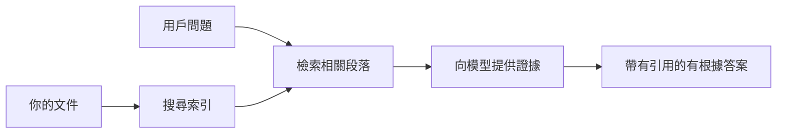

# 教 AI 根據您的文件回答問題：
## 系列 1：RAG、Azure 與開源替代方案，以及何時適合微調

> 這是 2026 年系列首篇文章，回顧我在 2023 年的 Azure AI Search + Azure OpenAI 文件問答教程。

系列導航：[資料庫首頁](../README.md) | 下一篇：[系列 2 - 端對端構建本地開源 RAG 系統](./series-2-open-source-rag-end-to-end.md)

## 1. 介紹 - 重溫早期的 RAG 教程

2023 年，我製作過一組教程，講述如何教 ChatGPT 從 PDF 文件中解答問題，使用 Azure AI Search 和 Azure OpenAI。我寫了 [LangChain 版本](https://techcommunity.microsoft.com/blog/educatordeveloperblog/teach-chatgpt-to-answer-questions-using-azure-ai-search--azure-openai-lang-chain/3969713)，並且與 [Lee Stott](https://developer.microsoft.com/en-us/advocates/lee-stott)（微軟資深雲端倡導經理）共同編寫了伴隨的 [Semantic Kernel 版本](https://techcommunity.microsoft.com/blog/educatordeveloperblog/teach-chatgpt-to-answer-questions-using-azure-ai-search--azure-openai-semantic-k/3985395)。當時，「用你的數據實現 ChatGPT」的概念對很多開發者來說仍然新穎。教程用到了 Azure Blob Storage、Azure AI Search、Azure OpenAI、LangChain、Semantic Kernel 以及 FAISS 類向量檢索來回答 PDF 檔案的問題。

那篇早期文章專注於一個簡單但重要的工作流程：上載文件、建立索引、檢索相關內容，然後根據內容向模型提問並獲得回答。

到 2026 年，RAG 生態系統已大幅成長。Azure AI Search 現在支持現代向量檢索和混合檢索模式，Azure OpenAI 是更廣泛的 Microsoft Foundry Models 生態系統一部分，且新版 v1 API 可使用標準 OpenAI 客戶端，不再需要每月更改 `api-version`。同時，LangGraph、LlamaIndex、Haystack、Qdrant、Milvus、Weaviate、Chroma、Ollama 和 vLLM 等開源選擇已成為實用的真實 RAG 系統方案。

這也是我想重溫這個主題的原因。問題不再只是「我該如何建立 RAG？」而是現在有很多種建立方式，更重要的是「我應該針對我的情況選擇哪種架構？」

但核心問題沒有變。

AI 模型不會自動知道您的文件。要建立有用的文件問答系統，仍需可靠的檢索、對齊（grounding）、評估和運營工作流程。

本文不是另一個端到端「與 PDF 對話」的教程，我想以我現在更關注的問題啟動這個更新系列：何時應該選擇管理型 Azure 架構？何時適合選擇開源 RAG 堆疊？又何時真正適合微調？

這是關於構建文件支撐 AI 系統系列的第一篇文章。在這部分，我們將關注架構決策：為什麼 RAG 重要？Azure 管理服務何時有用？開源替代方案何時適合？微調在哪裡適用？

在構建並重溫文件問答系統後，我更不關心哪款工具在演示中表現最好，而更關心真實用戶、文件變更、權限、故障及維護中哪種架構能持續穩定。

## 2. 為何您的 AI 需要搜尋系統

大型語言模型是在廣泛的公開及授權數據上訓練的。它們也許知道很多一般話題，但不會自動知道您的私有 PDF、內部政策、企業程序、研究資料庫、課堂教材、客戶支持筆記或近期更新文件。

簡單理解 RAG 是：我們不期待模型記住每份文件，而是給它一個搜尋系統。當用戶提問時，系統先找到最相關的資訊片段，再將這些內容作為上下文提供給模型。

這很重要，因為許多真實世界知識來源是私密的、持續變化的、需授權的，存放在多個系統中，以多種格式撰寫，且內容太多，無法直接貼入 prompt。

例如，一所學校、公司或研究團隊擁有 10,000 份內部文件時，模型不可能可靠地回答來自這些文件的問題，除非系統能在合適時間檢索正確的部分。

這自然導致一個常見問題：

為什麼不直接微調模型？

微調確實有用，但通常不是解決文件知識的首選工具。如果知識頻繁更新、有引用需求或必須考慮存取權限，RAG 通常是更佳起點。微調更適合教導行為、風格、輸出格式和任務模式。

## 3. 實踐中的 RAG 架構

想像您在為一所學校打造 AI 助手。這助手需要從政策 PDF、課程指南、內部常見問題頁面及最新公告中回答問題。

假如學生問：「我可不可以用生成式 AI 做期末作業？」系統不應該只從模型的一般記憶回答，而是應先找到相關校內政策，檢索出有關 AI 使用的章節，然後請模型根據該證據回答。

這就是 RAG 的實踐。

高層次來看，流程如下面：

細節會更複雜，但基本概念簡單：模型不獨立回答，而是帶著檢索到的證據回答。

首先，從 Azure Blob Storage、SharePoint、GitHub 或內部 CMS 等存儲系統中攝取文件。接著系統解析文件為文本，同時保留有用結構，如標題、頁碼、表格、章節及來源位置。

接著將內容切分成塊。這步看似簡單，實為系統中最重要部分之一。如果切塊太小，可能失去上下文；切塊太大，會包含無關資訊，降低檢索精度。

切塊完成後，系統會建立向量嵌入，並和原始文本及元資料（如檔名、頁碼、權限、文件版本、來源 URL）一併存入可搜尋索引。

用戶提問時，系統會使用關鍵字搜尋、向量搜尋或混合搜尋檢索候選塊。然後，重排序器會重新排列這些塊，將最有用的證據置頂。

最後，模型接收問題與檢索證據。回答應基於這證據，並返回引用，方便用戶查閱來源。

重點是 RAG 不只是「把 PDF 放入向量資料庫」。答案品質取決於整體流程：解析、切塊、檢索、重排序、提示、引用及評估。

這也是為何文件結構重要。在 PDF 中，標題、表格、腳註或頁碼界線能改變段落意義。在 Azure 上，Document Layout 技能利用 Azure Document Intelligence 的版面佈局能力，產生結構感知輸出，有助提升 RAG 系統的切塊與檢索品質。

## 4. 自 2023 年以來的變化

2023 年教程在當時是很好的起點：

- PDF 文件存放在 Azure Blob Storage。
- 內容由 Azure AI Search 建立索引。
- LangChain 將檢索連結 Azure OpenAI。
- FAISS 作為簡易本地向量庫。
- 範例用的是 `gpt-35-turbo` 和 `text-embedding-ada-002`。

到 2026 年，現代版本應反映幾項變更。

首先，檢索更成熟。2023 年，很多演示只用簡單向量相似度搜索。如今，混合檢索是嚴肅文件問答的預設起點。Azure AI Search 支援混合搜尋，可將關鍵字與向量查詢合併於單次請求，用互惠排名融合 (Reciprocal Rank Fusion) 合併結果。語義排名器可將全文、向量與混合結果中文本部分重新排序。

其次，攝取更複雜。不再需應用程式代碼手動切割每份文件，Azure AI Search 支援整合的向量化，用於切塊、嵌入與查詢時向量化。針對 PDF 與大量文件工作負載，Document Layout 技能可保存更多結構信息，而非固定大小切塊。

第三，編排更重要。困難不在於呼叫 LLM API，而是處理失敗、重試、過期檢索、切塊品質、長時間工作流、人類審查及大規模評估。這就使得以工作流導向的工具如 LangGraph、LlamaIndex 工作流、Haystack 流程管線及平台層評估與可觀察性工具，比簡單線性串接更具關聯。

第四，評估變得不可或缺。一個問題可以讓演示看起來很厲害，但生產系統需要測試集、回歸檢查、檢索指標、根據與監控。沒有評估，很難知道系統是改進還是僅僅改變。

## 5. Azure 與開源 RAG 堆疊的選擇

我不認為有用的問題是「Azure 比開源好嗎？」或「開源比 Azure 好嗎？」

有用的問題是：你正在建立什麼系統？誰來操作？有什麼限制？哪些失敗模式是不能接受的？

剛開始做文件問答示例，我主要關心檢索是否可用。能否上傳 PDF、檢索並產生答案？這是合理的起點。

經過更現實的 AI 工作流後，我的評估變了。現在選擇 RAG 堆疊前，我會看四個面向：

- 身份與權限
- 檢索品質
- 工作流可靠性
- 運營所有權

這四項比單純模型基準更有指標意義。

當企業整合是重點時，基於 Azure 的架構通常更合適。如果團隊已依賴 Microsoft Entra ID、Microsoft 365、Azure Storage、私有網絡、RBAC 和 Azure 監控，Azure AI Search 與 Azure OpenAI 可減少許多運營複雜度。在這種環境下，Azure 不只是模型 API，其價值在於周邊系統：身份、安全治理、管理式搜索、安全整合、技術支持及熟悉的運營。

當靈活性成為挑戰時，開源架構通常更合適。如果團隊需要本地推理、雲端移植性、自訂檢索流程、專門重排序或向量庫及模型服務層的直接控制，開源堆疊會更適合。但團隊必須負責更多可靠性工作：備份、擴展、延遲、遷移、監控與安全。

實務上，許多生產 AI 系統不是純雲端原生，也不是純開源，往往是平衡營運簡單、移植性、治理與工程靈活性的混合系統。

例如，我不意外看到某系統用 Azure OpenAI 做模型調用，用 LangGraph 做工作流編排，Azure 作為部署主機，開源向量庫滿足特定檢索需求。這不是架構不一致，而是對每部分系統選擇合適的管理服務層與工程掌控程度。

我喜歡混合架構，當管理平台解決重要企業問題，同時開源元件提供團隊在真正重要處的靈活性。

## 6. 實用決策指南

這是我會在選擇 RAG 堆疊前，與團隊一起使用的決策表：

| 決策領域 | 當... Azure 管理堆疊較優 | 當... 開源堆疊較優 |
| --- | --- | --- |
| 身份與存取 | 依賴 Entra ID、RBAC、管理型身份與企業權限 | 掌控自訂身份驗證、非 Microsoft 身份，或應用特有存取邏輯 |
| 運營 | 團隊需要管理基礎設施、支援、服務等級協議及簡化上手 | 團隊有能力操作向量庫、模型服務、備份與擴展 |
| 檢索 | 混合搜尋、語義排名、篩選及元資料檢索滿足大多需求 | 需要自訂檢索、專門重排序或實驗性索引 |
| 移植性 | 接受或偏好 Azure 生態系統 | 必須避免雲端鎖定 |
| 推理 | Azure OpenAI 管治、網絡及企業控管很重要 | 需本地推理、自訂模型或自行部署服務 |
| 成本 | 降低工程及運營工作量重於基礎架構優化 | 規模大到需細緻基礎架構調校 |
| 實驗 | 穩定性與企業整合重於頻繁變更組件 | 團隊快速迭代代理、工具、記憶與檢索工作流 |

我的經驗法則很簡單：

- 以企業整合、安全與運營簡單為主要考慮時，優先從 Azure 起步。
- 以移植性、客製化或本地掌控為主時，優先以開源起步。
- 兩者都有時，選擇混合堆疊。

這也是為何我不會在 2026 年的 RAG 系列一開始就先談程式碼。程式碼固然重要，但架構選擇應先於實作。簡單演示往往掩蓋最難抉擇。好 RAG 系統會將這些抉擇明確化。

## 7. 微調適用場景

微調常和 RAG 一起被提及，但我認為需將兩者區分開。

當系統需要即時、新鮮、私有、具權限限制或有明確來源的知識時，RAG 通常是較佳選擇。若答案須引用文件、反映最新更新或遵守用戶特定存取規則，檢索應是架構不可或缺部分。
微調在知識不是主要問題時更有用。當你希望模型遵循特定輸出格式、符合特定領域的回應風格、更穩定地執行任務，或減少每個提示中所需的指令量時，它都能發揮作用。

在實務中，兩者可以配合使用。支援助理可能會使用 RAG 來檢索最新政策，而微調後的模型則學習公司的偏好回答結構和語氣。

錯誤是在將微調視為替代文檔儲存。當系統必須從最新、私人或具權限敏感性的資料中回答時，仍然需要檢索。

## 8. 本系列的後續方向

本文是決策層。在寫程式碼之前，我想明確說明取捨：RAG 與微調、Azure 與開源、託管服務與操作控制。

在進入實作之前，我想在此留下一點：在許多企業 AI 系統中，模型只是其中一個組件。檢索品質、協調、評估、權限及運營可靠性通常決定了系統是否能超越展示階段成功。

在本系列後續部分，我計劃深入探討文件為基礎 AI 系統的實務部分：首先構建本地開源 RAG 工作流程，再利用 Azure AI Search 和 Azure OpenAI 重新建立相同場景，最後評估系統是否真正有效。

我可能會隨著系列進展調整順序，但目標不變：超越簡單展示，展示如何思考可維護、可評估及可操作的 RAG 系統。

## 9. 參考資料與資源

原始教學：

- [Teach ChatGPT to Answer Questions: Using Azure AI Search & Azure OpenAI (Lang Chain)](https://techcommunity.microsoft.com/blog/educatordeveloperblog/teach-chatgpt-to-answer-questions-using-azure-ai-search--azure-openai-lang-chain/3969713)
- [Teach ChatGPT to Answer Questions: Using Azure AI Search & Azure OpenAI (Semantic Kernel)](https://techcommunity.microsoft.com/blog/educatordeveloperblog/teach-chatgpt-to-answer-questions-using-azure-ai-search--azure-openai-semantic-k/3985395)

Azure：

- [Azure AI Search REST API versions](https://learn.microsoft.com/en-us/rest/api/searchservice/search-service-api-versions)
- [Hybrid search in Azure AI Search](https://learn.microsoft.com/en-us/azure/search/hybrid-search-how-to-query)
- [Integrated vectorization in Azure AI Search](https://learn.microsoft.com/en-us/azure/search/vector-search-integrated-vectorization)
- [Document Layout skill in Azure AI Search](https://learn.microsoft.com/en-us/azure/search/cognitive-search-skill-document-intelligence-layout)
- [Chunk and vectorize by document layout](https://learn.microsoft.com/en-us/azure/search/search-how-to-semantic-chunking)
- [Semantic ranking in Azure AI Search](https://learn.microsoft.com/en-us/azure/search/semantic-search-overview)
- [Azure OpenAI / Microsoft Foundry API version lifecycle](https://learn.microsoft.com/en-us/azure/foundry/openai/api-version-lifecycle)
- [Foundry Models sold by Azure](https://learn.microsoft.com/en-us/azure/foundry/foundry-models/concepts/models-sold-directly-by-azure)
- [Microsoft Foundry fine-tuning considerations](https://learn.microsoft.com/en-us/azure/foundry/openai/concepts/fine-tuning-considerations)
- [Microsoft Foundry observability](https://learn.microsoft.com/en-us/azure/foundry/concepts/observability)
- [Run evaluations in Microsoft Foundry](https://learn.microsoft.com/en-us/azure/foundry/how-to/evaluate-generative-ai-app)

開源：

- [LangGraph documentation](https://docs.langchain.com/oss/python/langgraph/overview)
- [LlamaIndex documentation](https://developers.llamaindex.ai/python/framework/)
- [Haystack documentation](https://docs.haystack.deepset.ai/)
- [Qdrant documentation](https://qdrant.tech/documentation/overview/)
- [Milvus documentation](https://milvus.io/docs/overview.md)
- [Weaviate documentation](https://docs.weaviate.io/weaviate/current/)
- [Chroma documentation](https://docs.trychroma.com/docs/overview/introduction)
- [Ollama embeddings](https://docs.ollama.com/capabilities/embeddings)
- [vLLM OpenAI-compatible server](https://docs.vllm.ai/en/latest/serving/openai_compatible_server.html)
- [BGE embedding models](https://huggingface.co/BAAI/bge-large-en-v1.5)
- [E5 embedding models](https://huggingface.co/intfloat/e5-large-v2)
- [Instructor embedding models](https://huggingface.co/hkunlp/instructor-large)

下一篇: [系列 2 - 端到端構建本地開源 RAG 系統](./series-2-open-source-rag-end-to-end.md)

---

<!-- CO-OP TRANSLATOR DISCLAIMER START -->
**免責聲明**：
本文件由 AI 翻譯服務 [Co-op Translator](https://github.com/Azure/co-op-translator) 翻譯而成。雖然我們致力於確保準確性，但請注意，機器自動翻譯可能包含錯誤或不準確之處。原始文件的母語版本應被視為權威來源。對於重要資訊，建議進行專業人工翻譯。我們不對因使用本翻譯而產生的任何誤解或誤釋承擔責任。
<!-- CO-OP TRANSLATOR DISCLAIMER END -->