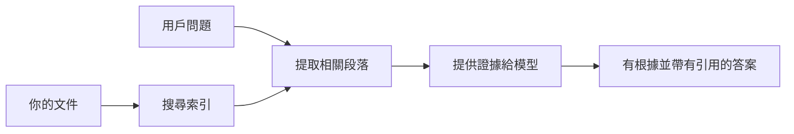

# 教 AI 根據你的文件回答問題：
## 系列 1：RAG、Azure 與開源替代方案，以及微調何時有意義

> 這是 2026 年一個系列中的第一篇文章，回顧我在 2023 年關於 Azure AI Search + Azure OpenAI 文件問答教學的內容。

## 1. 介紹 - 回顧早期的 RAG 教學

2023 年，我製作了一對教學，介紹如何教 ChatGPT 根據 PDF 文件回答問題，使用 Azure AI Search 和 Azure OpenAI。我寫了 [LangChain 版本](https://techcommunity.microsoft.com/blog/educatordeveloperblog/teach-chatgpt-to-answer-questions-using-azure-ai-search--azure-openai-lang-chain/3969713)，並且與微軟首席雲端推廣經理 [Lee Stott](https://developer.microsoft.com/en-us/advocates/lee-stott) 共同編寫了配套的 [Semantic Kernel 版本](https://techcommunity.microsoft.com/blog/educatordeveloperblog/teach-chatgpt-to-answer-questions-using-azure-ai-search--azure-openai-semantic-k/3985395)。當時，「在你的資料上運行 ChatGPT」的概念對許多開發者來說仍然是新的。這些教學使用了 Azure Blob Storage、Azure AI Search、Azure OpenAI、LangChain、Semantic Kernel 和類似 FAISS 的向量檢索，來實現從 PDF 文件回答問題。

當時的文章著重於一個簡單但重要的工作流程：上傳文件、編目、檢索相關內容，並要求模型根據這些內容回答問題。

到了 2026 年，RAG 生態系統有了顯著成長。Azure AI Search 現在支持現代向量和混合檢索模式，Azure OpenAI 是更廣泛的 Microsoft Foundry Models 生態系統一部分，而新版 v1 API 可以使用標準 OpenAI 客戶端，無需每月更改 `api-version`。同時，許多開源選項如 LangGraph、LlamaIndex、Haystack、Qdrant、Milvus、Weaviate、Chroma、Ollama 和 vLLM 已成為實際可用的 RAG 系統選擇。

這就是為什麼我想重新探討這個話題。問題不僅是「我該怎麼建立 RAG？」現在有很多種建立方式，更重要的問題是「我應該為我的情況選擇哪種架構？」

但核心問題沒有改變。

AI 模型不會自動知道你的文件內容。要建設有用的文件問答系統，你仍然需要可靠的檢索、依據、評估和運營工作流程。

本文不是另一個端到端的「與 PDF 聊天」教學。我想以我現在更關心的問題開始這個更新系列：你何時該選擇受管理的 Azure 架構，何時該選擇開源 RAG 堆棧，何時微調實際上才有意義？

這是有關建立文件依據 AI 系統系列的第一篇。在這部分，我們會專注於架構決策：為什麼 RAG 很重要，何時基於 Azure 的受管理服務有用，何時開源替代方案合適，以及微調位於何處。

在建立並重新檢視文件問答系統後，我對哪個工具在示範中看起來最好不再感興趣，而更關注哪個架構能在真實使用者、更動的文件、權限、故障和維護中存活。

## 2. 為什麼你的 AI 需要檢索系統

大型語言模型是在廣泛的公共與授權數據上訓練的。它們可能對一般話題了解很多，但不會自動知道你的私有 PDF、內部政策、企業程序、研究檔案、課堂材料、客戶支持筆記或最近更新的文件。

理解 RAG 的一個簡單方式是：我們不期待模型記住每份文件，而是提供一個檢索系統。當用戶提出問題時，系統先找出最相關的資訊片段，再把這些作為上下文提供給模型。

這很重要，因為許多現實世界的知識來自私有、持續變動、權限敏感、跨多個系統存放、格式多樣且無法直接複製貼上到提示中的來源。

舉例來說，如果一所學校、公司或研究團隊有 10,000 份內部文件，模型無法可靠地從這些文件中直接回答，除非系統能在對的時間檢索到正確的部分。

這自然導出一個常見問題：

為什麼不直接微調模型？

微調有其用處，但通常不是處理文件知識的第一選擇。如果知識頻繁更改、引用很重要、或存取權限需要嚴格控制，RAG 通常是較好的起點。微調比較適合教導行為、風格、輸出格式以及任務模式。

## 3. RAG 架構實務

想像你正在為一所學校建立 AI 助手。助手需要回答來自政策 PDF、課程指引、內部常見問題頁面和最近更新公告的問題。

如果學生問：「我能用生成式 AI 完成期末作業嗎？」，系統不該只從模型的泛化記憶答覆。它應先找到相關的校方政策，檢索 AI 使用規範段落，再請模型基於此證據作答。

這就是 RAG 的實際作法。

大致流程如下：

細節可以很複雜，但基本想法簡單：模型不是獨自回答，而是基於檢索到的證據回答。

首先，文件從儲存系統（如 Azure Blob Storage、SharePoint、GitHub 或內部 CMS）匯入。系統再將文件解析成文本，同時保留有用的結構，如標題、頁碼、表格、章節和來源位址。

接著，內容分割成多個片段。這步看似簡單，卻是系統中極重要的部分。片段太小可能失去上下文，片段太大可能包含無關資訊，降低檢索精準度。

切分後，系統會建立嵌入向量，並與原文及元資料（如檔名、頁碼、權限、文件版本和 URL）一起存入可檢索的索引。

當用戶發問時，系統會用關鍵字搜尋、向量搜尋或混合搜尋來檢索候選片段。然後重新排序器會調整結果，使最有用的證據排在前面。

最後，模型接收問題和檢索到的證據。回應必須以這些證據為依據，並附帶出處，讓使用者能查驗來源。

重點是：RAG 不只是「把 PDF 放入向量資料庫」。答案品質取決於整個流程：解析、分段、檢索、重排序、提示、引用和評估。

這也是為什麼文件結構很重要。在 PDF 中，標題、表格、腳註或頁面邊界都會改變段落的意義。在 Azure 上，Document Layout 技能使用 Azure Document Intelligence 版面分析能力產出具結構感知的輸出，可以提升 RAG 系統的分段和檢索質量。

## 4. 自 2023 年以來的變化

2023 年的教學當時是個好起點：

- 使用 Azure Blob Storage 儲存 PDF。
- 用 Azure AI Search 編目內容。
- LangChain 負責連接檢索與 Azure OpenAI。
- FAISS 作為簡易本地向量庫。
- 範例使用了 `gpt-35-turbo` 和 `text-embedding-ada-002`。

到了 2026 年，現代版本應反映這些變化。

首先，檢索更成熟。2023 年，許多示範僅用簡單的向量相似度搜尋。現在，混合檢索成為嚴肅文件問答的預設起點。Azure AI Search 支援一次請求結合關鍵字和向量查詢，並使用 Reciprocal Rank Fusion 合併結果。語義排序器可重新排序全文、向量和混合結果中的文本。

第二，文檔匯入更精細。現在不需手動用應用碼分割每份文件，Azure AI Search 支援整合向量化來實現切分、embedding，以及查詢時向量化。對 PDF 和文件密集工作負載，Document Layout 技能能保留比固定大小切片更多的結構。

第三，協調更重要。困難常在於 LLM API 呼叫之外：要處理失敗、重試、過期檢索、切片品質、長流程執行、人為審核和規模評估。這時工作流導向的工具如 LangGraph、LlamaIndex workflow、Haystack pipeline，以及平台層級的評估和監控工具比單一線性鏈更關鍵。

第四，評估不再可有可無。一個問題的示範可能看起來很酷，但生產系統需要測試集、回歸檢查、檢索指標、依據檢查及監控。沒有評估，就難以判斷系統是在進步還是僅僅改變。

## 5. 選擇 Azure 或開源 RAG 堆棧

我認為有用的問題不是「Azure 比開源好還是開源比 Azure 好？」

而是：你建造的是什麼樣的系統？誰來操作？有什麼限制？什麼失敗情況不可接受？

起初，我做文件問答範例，主要想法是檢索功能是否可行。能否上傳 PDF，搜尋它們，並生成答案？這是合理的初始點。

隨著深入更實際的 AI 工作流，我的評估變了。我現在在選擇 RAG 堆棧前會考慮四個面向：

- 身份與權限
- 檢索品質
- 工作流可靠性
- 運營歸屬

這四個面向比僅靠模型基準測試告訴你更多。

基於 Azure 的架構通常合適於企業整合複雜的情況。如果團隊已依賴 Microsoft Entra ID、Microsoft 365、Azure Storage、私有網路、RBAC 和 Azure 監控，Azure AI Search 與 Azure OpenAI 能夠大幅減少運營複雜度。在這種環境下，Azure 不只是模型 API，更重要的是周邊系統：身份、治理、管理檢索、安全整合、技術支援與熟悉的運維流程。

開源架構通常適合彈性需求高的情況。如果團隊需要本地推斷能力、雲端可攜性、自訂檢索管線、專用重新排序，或直接控制向量資料庫及模型服務層，開源堆棧會是更好選擇。代價是團隊需自行承擔更多可靠度工作：備份、擴展、延遲、遷移、監控、安全。

實際上，許多生產 AI 系統不是純雲端原生，也非純開源。它們多為混合系統，在運維簡便性、可攜、治理與工程靈活性中尋求平衡。

舉例來說，我不會覺得奇怪看到系統用 Azure OpenAI 訪問模型，用 LangGraph 管理工作流，部署 Azure 主機，而針對特定檢索需求用開源向量資料庫。這不是架構不一致，而是為系統中每個部分選擇適當的受管理服務與工程控制等級。

我喜歡混合架構，當受管理平臺解決重要企業問題，且開源元件在實際重要的地方提供彈性。

## 6. 實務決策指南

以下是我會在團隊中用來選擇 RAG 堆棧的決策表：

| 決策面向 | Azure 受管理堆棧較強的狀況 | 開源堆棧較強的狀況 |
| --- | --- | --- |
| 身份與存取 | 中心是 Entra ID、RBAC、受管理身份和企業權限 | 以自訂驗證、非微軟身份，或應用專屬存取邏輯為主 |
| 運營 | 團隊需要受管理基礎設施、支援、服務水平協議與較簡單上線 | 團隊自行操作向量資料庫、模型服務、備份和擴展 |
| 檢索 | 混合搜索、語義排序、篩選和元資料搜索覆蓋大多數需求 | 團隊需要自訂檢索、專用重新排序或實驗性編目 |
| 可攜性 | 接受或偏好 Azure 生態系統 | 必須避免雲端綁定 |
| 推斷 | 關注 Azure OpenAI 治理、網路和企業控管 | 需要本地推斷、自訂模型或自託管服務 |
| 成本 | 降低工程和運營工作優先於基礎設施調優 | 規模足夠大，需講究基礎設施優化 |
| 實驗 | 穩定性與企業整合優先於頻繁更換元件 | 團隊快速迭代代理、工具、記憶與檢索工作流 |

我的經驗法則很簡單：

- 當企業整合、安全與運營簡便是主要風險，先用 Azure。
- 當可攜性、自訂化或本地控制是主要風險，先用開源。
- 兩者都有時，用混合堆棧。

這也是為何我不會從代碼起步開始 2026 RAG 系列。代碼重要，但架構選擇優先於實作。一個簡單示範可以掩蓋最難的決策。好的 RAG 系統使這些決策明確。

## 7. 微調的定位

微調常與 RAG 一起提，但我認為有必要區分兩者。

當系統需要最新、私密、權限敏感或依據來源的知識時，RAG 通常是更佳選擇。如果答案需要引用文件、反映近期更新或尊重特定使用者存取規則，檢索必須納入架構。

微調更適合當知識不是主要問題。它能幫助模型遵循特定輸出格式、匹配領域專屬回應風格、更穩定地執行任務，或減少每次提示需包含指令的量。
在實務上，兩者可以同時合作。支援助理可能會使用RAG來檢索最新的政策，同時經過微調的模型則學習公司的偏好答覆結構與語氣。

錯誤是將微調視為替代文件庫。當系統必須從最新的私人或需要權限的數據中回答時，仍然需要檢索功能。

## 8. 本系列下一步

本文是決策層。在撰寫程式碼之前，我想明確說明取捨：RAG與微調、Azure與開源、託管服務與運維控制。

在進入實作之前，我想先留下這一點：在許多企業 AI 系統中，模型只是其中一個組成部分。檢索品質、協調、評估、權限和運營可靠性通常才是系統是否能超越示範階段的決定因素。

在本系列接下來的部分，我計劃深入探討文件根據型 AI 系統的實務面：如何建立基於 Azure 的架構、開源替代方案在實務中的比較，以及如何評估 RAG 系統是否真正有效。

隨著系列進展，我可能會調整順序，但目標都保持一致：超越簡單示範，展示如何思考可維護、可評估且可運營的 RAG 系統。

## 9. 參考資料與資源

原始教學：

- [Teach ChatGPT to Answer Questions: Using Azure AI Search & Azure OpenAI (Lang Chain)](https://techcommunity.microsoft.com/blog/educatordeveloperblog/teach-chatgpt-to-answer-questions-using-azure-ai-search--azure-openai-lang-chain/3969713)
- [Teach ChatGPT to Answer Questions: Using Azure AI Search & Azure OpenAI (Semantic Kernel)](https://techcommunity.microsoft.com/blog/educatordeveloperblog/teach-chatgpt-to-answer-questions-using-azure-ai-search--azure-openai-semantic-k/3985395)

Azure：

- [Azure AI Search REST API 版本](https://learn.microsoft.com/en-us/rest/api/searchservice/search-service-api-versions)
- [Azure AI Search 中的混合搜尋](https://learn.microsoft.com/en-us/azure/search/hybrid-search-how-to-query)
- [Azure AI Search 中的整合向量化](https://learn.microsoft.com/en-us/azure/search/vector-search-integrated-vectorization)
- [Azure AI Search 中文件佈局技能](https://learn.microsoft.com/en-us/azure/search/cognitive-search-skill-document-intelligence-layout)
- [依文件佈局切塊並向量化](https://learn.microsoft.com/en-us/azure/search/search-how-to-semantic-chunking)
- [Azure AI Search 中的語意排序](https://learn.microsoft.com/en-us/azure/search/semantic-search-overview)
- [Azure OpenAI / Microsoft Foundry API 版本生命週期](https://learn.microsoft.com/en-us/azure/foundry/openai/api-version-lifecycle)
- [Azure 銷售的 Foundry 模型](https://learn.microsoft.com/en-us/azure/foundry/foundry-models/concepts/models-sold-directly-by-azure)
- [Microsoft Foundry 微調考量](https://learn.microsoft.com/en-us/azure/foundry/openai/concepts/fine-tuning-considerations)
- [Microsoft Foundry 可觀察性](https://learn.microsoft.com/en-us/azure/foundry/concepts/observability)
- [在 Microsoft Foundry 執行評估](https://learn.microsoft.com/en-us/azure/foundry/how-to/evaluate-generative-ai-app)

開源：

- [LangGraph 文件](https://docs.langchain.com/oss/python/langgraph/overview)
- [LlamaIndex 文件](https://developers.llamaindex.ai/python/framework/)
- [Haystack 文件](https://docs.haystack.deepset.ai/)
- [Qdrant 文件](https://qdrant.tech/documentation/overview/)
- [Milvus 文件](https://milvus.io/docs/overview.md)
- [Weaviate 文件](https://docs.weaviate.io/weaviate/current/)
- [Chroma 文件](https://docs.trychroma.com/docs/overview/introduction)
- [Ollama 嵌入向量](https://docs.ollama.com/capabilities/embeddings)
- [vLLM OpenAI 相容伺服器](https://docs.vllm.ai/en/latest/serving/openai_compatible_server.html)
- [BGE 嵌入模型](https://huggingface.co/BAAI/bge-large-en-v1.5)
- [E5 嵌入模型](https://huggingface.co/intfloat/e5-large-v2)
- [Instructor 嵌入模型](https://huggingface.co/hkunlp/instructor-large)

---

<!-- CO-OP TRANSLATOR DISCLAIMER START -->
**免責聲明**：
本文件由 AI 翻譯服務 [Co-op Translator](https://github.com/Azure/co-op-translator) 翻譯而成。雖然我們致力於確保準確性，但請注意，機器自動翻譯可能包含錯誤或不準確之處。原始文件的母語版本應被視為權威來源。對於重要資訊，建議進行專業人工翻譯。我們不對因使用本翻譯而產生的任何誤解或誤釋承擔責任。
<!-- CO-OP TRANSLATOR DISCLAIMER END -->