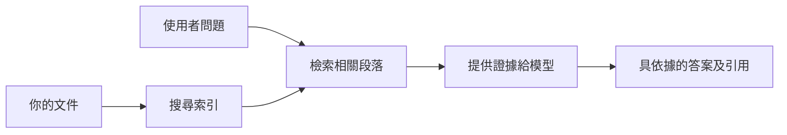

# 教 AI 根據您的文件回答問題：
## 系列 1：RAG、Azure 與開源替代方案、以及何時適合微調

> 2026 年一系列文章的第一篇，重新探討我在 2023 年的 Azure AI Search + Azure OpenAI 文件問答教學。

系列導航：[版本庫主頁](../README.md) | 下一篇：[系列 2 - 從頭到尾構建本地開源 RAG 系統](./series-2-open-source-rag-end-to-end.md)

## 1. 簡介 - 重溫早期的 RAG 教學

在 2023 年，我曾撰寫過一對教學，介紹如何使用 Azure AI Search 和 Azure OpenAI 教 ChatGPT 根據 PDF 文件回答問題。我寫了[LangChain 版本](https://techcommunity.microsoft.com/blog/educatordeveloperblog/teach-chatgpt-to-answer-questions-using-azure-ai-search--azure-openai-lang-chain/3969713)，並與微軟首席雲端推廣經理 [Lee Stott](https://developer.microsoft.com/en-us/advocates/lee-stott) 合作撰寫了搭配的[Semantic Kernel 版本](https://techcommunity.microsoft.com/blog/educatordeveloperblog/teach-chatgpt-to-answer-questions-using-azure-ai-search--azure-openai-semantic-k/3985395)。當時，「讓 ChatGPT 利用你的數據」這個概念對許多開發者來說仍然新鮮。這些教學示範使用 Azure Blob Storage、Azure AI Search、Azure OpenAI、LangChain、Semantic Kernel，以及類似 FAISS 的向量檢索方式，來從 PDF 檔案回答問題。

那篇早期的文章聚焦於一個簡單但重要的流程：上傳文件、建索引、檢索相關內容，然後根據該內容請模型來回答。

到了 2026 年，RAG 生態系統大幅擴展。Azure AI Search 現已支援現代向量及混合檢索模式，Azure OpenAI 成為更廣泛 Microsoft Foundry 模型生態系統的一部分，而新版 v1 API 可使用標準 OpenAI 用戶端，無需每月更改 `api-version`。同時，開源選項如 LangGraph、LlamaIndex、Haystack、Qdrant、Milvus、Weaviate、Chroma、Ollama 和 vLLM 也成為實際應用於真實 RAG 系統的選擇。

這也是我想重溫這個主題的原因。問題已不再只是「我怎麼建立 RAG？」現在有很多架構選擇，更重要的問題是「我該為我的情況選擇哪種架構？」

但核心問題未變：

AI 模型不會自動知道您的文件內容。要建立有用的文件問答系統，仍需可靠的檢索、基礎支撐、評估及運營流程。

本文不是另一個端到端「與 PDF 聊天」教學。我想以我現在更關心的問題開始這個更新系列：何時應該選擇託管的 Azure 架構，何時應該選擇開源 RAG 堆疊，以及何時微調才真正有意義？

本文是關於建立以文件為基礎的 AI 系統系列之第一篇。在這部分我們將聚焦於架構決策：為什麼 RAG 很重要、何時 Azure 託管服務有用、何時開源方案更合適、以及微調置於何處。

經過多次建立及重溫文件問答系統，我對於哪個工具在演示中看起來最好已不大感興趣，反而更關注哪個架構能經受住真正使用者、內容變化、權限、故障及維護的考驗。

## 2. 為什麼您的 AI 需要搜尋系統

大型語言模型是利用廣泛的公共及授權資料訓練的。它們可能對一般主題瞭若指掌，但不會自動知道您的私有 PDF、內部政策、企業程序、研究檔案、課堂材料、客戶支援紀錄或近期更新的文件。

簡單來說，RAG 的想法是：我們不期待模型記住每一份文件，而是給它一個搜尋系統。當使用者提問時，系統先找出最相關的資訊片段，再將這些片段作為上下文給模型。

這點很重要，因為許多真實世界的知識來源是私密的、不斷變動的、對權限敏感的，分散在多個系統中，使用多種格式，且內容太龐大無法直接貼入提示。

舉例來說，如果一所學校、公司或研究團隊有 10,000 份內部文件，模型無法可靠地從中回答問題，除非系統能夠在正確時間檢索到關鍵內容。

這自然引發一個常見問題：

為什麼不直接微調模型？

微調當然有用，但通常不是文件知識的首選工具。如果知識經常變動、引用很重要，或存取權限關鍵，RAG 通常是較佳的起點。微調較適合教授行為、風格、輸出格式和任務模式。

## 3. 實務中的 RAG 架構

想像您正在為一所學校打造 AI 助手。此助手需能回答政策 PDF、課程指南、內部 FAQ 頁面以及近期公告相關的問題。

若學生問：「我可以用生成式 AI 來完成我的期末作業嗎？」系統不應該只依靠模型一般記憶回答，而應先找到相關的校內政策，檢索有關 AI 使用的章節，再請模型根據這些證據來回答。

這就是實務中的 RAG。

從高層看，可將流程想像成：

細節會更複雜，但基本概念很簡單：模型不是獨立作答，而是依據檢索到的證據來回覆。

首先，從 Azure Blob Storage、SharePoint、GitHub 或內部 CMS 等存儲系統中導入文件。接著系統把文件解析成文本，同時保留標題、頁碼、表格、章節和來源位置等有用結構。

然後，將內容切分為多個區塊。這步驟看似簡單，但卻是最重要的部分之一。區塊太小可能會失去周圍上下文，太大則可能包含無關資訊，降低檢索精準度。

之後，系統會建立嵌入向量，並與原始文本和元資料（如檔名、頁碼、權限、文件版本及來源網址）一起，存入可搜尋的索引。

當使用者提出問題時，系統會利用關鍵字搜尋、向量搜尋或混合搜尋檢索候選區塊。再由重排器對這些區塊進行排序，將最有用的證據排在前面。

最後，模型同時接收到問題和檢索到的證據。回答應該基於這些證據並提供引用資訊，讓使用者能查閱來源。

重點是，RAG 不只是「把 PDF 放進向量資料庫」。回答品質取決於整個工作流程：解析、切分、檢索、重排、提示、引用和評估。

這也是為什麼文件結構這麼重要。在 PDF 中，標題、表格、註腳或頁面邊界都可能改變段落的含義。在 Azure 上，Document Layout 技能利用 Azure Document Intelligence 的版面配置能力產生結構感知的輸出，可以提升 RAG 系統的切分和檢索品質。

## 4. 自 2023 年以來的變化

2023 年的教學對當時來說是良好的起點：

- 使用 Azure Blob Storage 存放 PDF 檔。
- Azure AI Search 建立內容索引。
- LangChain 連接檢索與 Azure OpenAI。
- FAISS 作為簡單的本地向量庫。
- 範例使用了 `gpt-35-turbo` 和 `text-embedding-ada-002`。

到了 2026 年，現代版本應反映數項改變。

首先，檢索已更成熟。2023 年許多示範只用簡單的向量相似度搜尋。現今混合檢索常是認真做文件問答的預設起點。Azure AI Search 支援在單一請求中結合關鍵字與向量查詢，並用 Reciprocal Rank Fusion 融合結果。Semantic ranker 可重排全文、向量及混合搜尋的文字結果。

其次，資料導入更複雜。非單用應用程式程式碼手動拆分文件，Azure AI Search 支援內建向量化，用於切分、嵌入與查詢時向量化。針對 PDF 和文件量大的工作負載，Document Layout 技能可保留比固定大小區塊更完整結構。

第三，編排更重要。難點通常不是 LLM API 調用本身，而是處理失敗、重試、過期檢索、區塊品質、長時間工作流、人工作業檢閱和大規模評估。這方面，像 LangGraph、LlamaIndex 工作流、Haystack 管線，以及平台級評估和可觀察性工具，比單一線性鏈更具關聯。

第四，評估不再可選。一個問題演示看起來很酷，生產系統則需要測試集、回歸檢查、檢索指標、基礎度檢查和監控。沒有評估，就難以知道系統是在進步還是單純改變。

## 5. Azure 與開源 RAG 堆疊間的選擇

我不認為有用的問題是「Azure 比開源好嗎？」或「開源比 Azure 好嗎？」

真正有用的問題是：您打造何種系統？誰來運營？有哪些限制？哪些失敗模態不可接受？

我剛開始做文件問答範例時，大多只關心檢索能不能用。是否能上傳 PDF、搜尋它們，並生成答案？這是合理的起點。

經過更現實的 AI 工作流後，我的評估改變了。現在，選擇 RAG 堆疊前，我會先考慮四個面向：

- 身份與權限
- 檢索品質
- 工作流可靠性
- 運維擁有權

這四方面能告訴你比單純模型基準更多訊息。

Azure 架構在企業整合是難點時通常較合適。如果團隊已依賴 Microsoft Entra ID、Microsoft 365、Azure Storage、私有網路、RBAC 及 Azure 監控，Azure AI Search 和 Azure OpenAI 可大幅減少運維複雜度。在這環境中，Azure 不只是一個模型 API，價值在於周邊系統：身份、治理、託管搜尋、安全整合、支援及熟悉的運維。

開源架構通常適合需求彈性高者。如果團隊需要本地推理、雲端可攜性、自訂檢索管線、專用重排，或直接控制向量資料庫與模型服務層，開源堆疊可能更契合。取捨是團隊需要自行負擔更大量的可靠度工作，如備份、擴展、延遲、遷移、監控及安全。

實務上，許多生產 AI 系統不是純粹雲端原生也非全然開源，而是會有混和型系統，在運維簡化、可攜性、治理與工程彈性間取得平衡。

例如，我不會感到驚訝看到系統使用 Azure OpenAI 取得模型，LangGraph 負責工作流編排，Azure 托管部署，且為某個特定檢索需求採用開源向量資料庫。這不是架構上的矛盾，而是為系統每個部分選擇適當管理服務層級與工程控制。

我喜歡混合架構，當管理平台解決重要企業問題，而開源元件在真正關鍵處提供彈性。

## 6. 實務決策指南

以下是我與團隊在選擇 RAG 堆疊前會用的決策表：

| 決策面向 | Azure 託管堆疊較強時… | 開源堆疊較強時… |
| --- | --- | --- |
| 身份與存取 | 依賴 Entra ID、RBAC、管理身份及企業權限為核心 | 以自訂認證、非 Microsoft 身份或應用特定存取邏輯為主 |
| 運維 | 團隊需要託管基礎設施、支援、SLA 及較簡單的入門 | 團隊能管理向量資料庫、模型服務、備份與擴展 |
| 檢索 | 混合搜索、語意排序、篩選及元資料搜索能滿足大部分需求 | 需要自訂檢索、專用重排或試驗性索引 |
| 可攜性 | 接受或偏好 Azure 生態系統對接 | 嚴格要求避免雲鎖定 |
| 推理 | Azure OpenAI 的治理、網路及企業控制很重要 | 需本地推理、自訂模型或自行架設服務 |
| 成本 | 重視減少工程及運維努力多於基礎設施微調 | 規模足夠大，需要精細基礎設施優化 |
| 實驗 | 穩定性及企業整合重於頻繁更換元件 | 團隊快速迭代代理、工具、記憶及檢索工作流 |

我的經驗法則很簡單：

- 若企業整合、安全與運維簡易是主要風險，就先用 Azure。
- 若可攜性、自訂或本地控制是主要風險，就先用開源。
- 若兩者皆是，就用混合堆疊。

這也是為什麼我不會以代碼啟動 2026 年 RAG 系列。代碼固然重要，但架構選擇優先於實作。簡單的演示可以掩蓋最難的選擇。好的 RAG 系統會將這些選擇明確化。

## 7. 微調的位置

微調常與 RAG 一同被提及，但我覺得分清兩者很重要。

當系統需要新鮮、私密、權限敏感或有來源依據的知識時，RAG 通常是更好的選擇。如果回答需要引用文件、反映近期更新，或遵守用戶特定的存取規則，檢索應是架構組成部分。
微調在知識不是主要問題時更有用。當你希望模型遵循特定輸出格式、匹配特定領域的回應風格、更穩定地執行某項任務，或減少每個提示中所需指令的數量時，它能提供幫助。

實務上，兩者可以協同工作。客服助理可能會使用 RAG 來檢索最新政策，同時微調模型學習公司偏好的回答結構和語氣。

錯誤的做法是將微調當作文件庫的替代品。當系統必須從最新的、私人或需權限保護的數據回答時，這並不會取代檢索的需求。

## 8. 這系列的下一步

本文是決策層。在編寫代碼之前，我想將取捨明確化：RAG 與微調，Azure 與開源，管理服務與操作控制。

在進入實作之前，我想留下這一點：在許多企業 AI 系統中，模型只是其中一個組件。檢索質量、編排、評估、權限和操作可靠性往往決定了系統是否能成功通過示範階段。

這系列的下一部分，我計劃深入探討文件依據 AI 系統的實務面：首先建立一個本地開源的 RAG 工作流程，接著用 Azure AI Search 與 Azure OpenAI 重建相同場景，然後評估系統是否真正有效。

隨著系列發展，我可能會調整順序，但目標不變：超越簡單示範，展現如何思考能被維護、評估與操作的 RAG 系統。

## 9. 參考資料與資源

原始教學：

- [教 ChatGPT 回答問題：使用 Azure AI Search 與 Azure OpenAI（Lang Chain）](https://techcommunity.microsoft.com/blog/educatordeveloperblog/teach-chatgpt-to-answer-questions-using-azure-ai-search--azure-openai-lang-chain/3969713)
- [教 ChatGPT 回答問題：使用 Azure AI Search 與 Azure OpenAI（Semantic Kernel）](https://techcommunity.microsoft.com/blog/educatordeveloperblog/teach-chatgpt-to-answer-questions-using-azure-ai-search--azure-openai-semantic-k/3985395)

Azure：

- [Azure AI Search REST API 版本](https://learn.microsoft.com/en-us/rest/api/searchservice/search-service-api-versions)
- [Azure AI Search 混合搜尋](https://learn.microsoft.com/en-us/azure/search/hybrid-search-how-to-query)
- [Azure AI Search 內建向量化](https://learn.microsoft.com/en-us/azure/search/vector-search-integrated-vectorization)
- [Azure AI Search 中文件版面技能](https://learn.microsoft.com/en-us/azure/search/cognitive-search-skill-document-intelligence-layout)
- [利用文件版面分段並向量化](https://learn.microsoft.com/en-us/azure/search/search-how-to-semantic-chunking)
- [Azure AI Search 語意排序](https://learn.microsoft.com/en-us/azure/search/semantic-search-overview)
- [Azure OpenAI / Microsoft Foundry API 版本生命週期](https://learn.microsoft.com/en-us/azure/foundry/openai/api-version-lifecycle)
- [Azure 直售的 Foundry 模型](https://learn.microsoft.com/en-us/azure/foundry/foundry-models/concepts/models-sold-directly-by-azure)
- [Microsoft Foundry 微調注意事項](https://learn.microsoft.com/en-us/azure/foundry/openai/concepts/fine-tuning-considerations)
- [Microsoft Foundry 可觀察性](https://learn.microsoft.com/en-us/azure/foundry/concepts/observability)
- [在 Microsoft Foundry 執行評估](https://learn.microsoft.com/en-us/azure/foundry/how-to/evaluate-generative-ai-app)

開源：

- [LangGraph 文件](https://docs.langchain.com/oss/python/langgraph/overview)
- [LlamaIndex 文件](https://developers.llamaindex.ai/python/framework/)
- [Haystack 文件](https://docs.haystack.deepset.ai/)
- [Qdrant 文件](https://qdrant.tech/documentation/overview/)
- [Milvus 文件](https://milvus.io/docs/overview.md)
- [Weaviate 文件](https://docs.weaviate.io/weaviate/current/)
- [Chroma 文件](https://docs.trychroma.com/docs/overview/introduction)
- [Ollama 向量嵌入](https://docs.ollama.com/capabilities/embeddings)
- [vLLM OpenAI 相容服務器](https://docs.vllm.ai/en/latest/serving/openai_compatible_server.html)
- [BGE 向量嵌入模型](https://huggingface.co/BAAI/bge-large-en-v1.5)
- [E5 向量嵌入模型](https://huggingface.co/intfloat/e5-large-v2)
- [Instructor 向量嵌入模型](https://huggingface.co/hkunlp/instructor-large)

下一篇：[系列 2 - 從頭到尾建構本地開源 RAG 系統](./series-2-open-source-rag-end-to-end.md)

---

<!-- CO-OP TRANSLATOR DISCLAIMER START -->
**免責聲明**：
本文件使用 AI 翻譯服務 [Co-op Translator](https://github.com/Azure/co-op-translator) 進行翻譯。雖然我們力求準確，但請注意，自動翻譯可能包含錯誤或不準確之處。原始文件的母語版本應被視為權威來源。對於重要資訊，建議尋求專業人工翻譯。我們不對因使用本翻譯而引起的任何誤解或曲解承擔責任。
<!-- CO-OP TRANSLATOR DISCLAIMER END -->