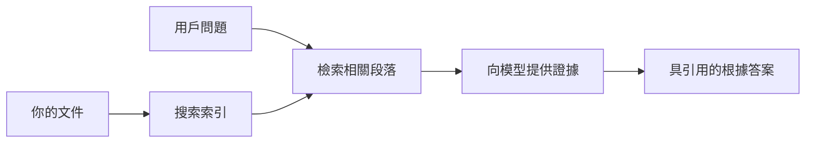

# 教 AI 根據您的文件回答問題：
## 系列 1：RAG、Azure 與開源替代方案比較，以及何時適合微調

> 這是 2026 年系列文章的第一篇，重訪我 2023 年關於 Azure AI Search + Azure OpenAI 文件問答教學。

## 1. 介紹 - 重溫早期的 RAG 教學

2023 年，我製作了一對教學，關於如何教 ChatGPT 使用 Azure AI Search 和 Azure OpenAI 來回答 PDF 文件中的問題。我撰寫了 [LangChain 版本](https://techcommunity.microsoft.com/blog/educatordeveloperblog/teach-chatgpt-to-answer-questions-using-azure-ai-search--azure-openai-lang-chain/3969713)，也與微軟首席雲倡導經理 [Lee Stott](https://developer.microsoft.com/en-us/advocates/lee-stott) 共同撰寫了伴隨的 [Semantic Kernel 版本](https://techcommunity.microsoft.com/blog/educatordeveloperblog/teach-chatgpt-to-answer-questions-using-azure-ai-search--azure-openai-semantic-k/3985395)。當時，「用你的資料運行 ChatGPT」的概念對許多開發者來說仍感新鮮。這些教學使用了 Azure Blob Storage、Azure AI Search、Azure OpenAI、LangChain、Semantic Kernel 及 FAISS 式向量檢索，來回答 PDF 文件中的問題。

當時的文章聚焦於一個簡單但重要的工作流程：上傳文件、建立索引、檢索相關內容，並基於該內容請模型回答問題。

到了 2026 年，RAG 生態系統顯著成長。Azure AI Search 現在支援現代向量和混合檢索模式，Azure OpenAI 是微軟 Foundry 模型生態系統的一部分，新版 v1 API 能使用標準 OpenAI 客戶端，不必每月更改 `api-version`。同時，LangGraph、LlamaIndex、Haystack、Qdrant、Milvus、Weaviate、Chroma、Ollama 及 vLLM 等開源選項已成為真正 RAG 系統的實際選擇。

這也是我想重訪這個話題的原因。問題不再是「如何構建 RAG？」，而是有很多建構方式，更重要的問題是「我應為自己的情況選擇哪種架構？」

但核心問題仍未改變。

AI 模型不會自動知道你的文件。要建立實用的文件問答系統，你仍需可靠的檢索、落地、評估及運營流程。

本文不是另一篇端對端的「和 PDF 聊天」教學。我希望從我現在更關心的問題開始這個更新系列：何時應選擇受管的 Azure 架構，何時應選擇開源 RAG 堆疊，以及何時真的適合微調？

這是關於構建基於文件的 AI 系統系列的第一篇。我們在本篇將專注於架構決策：為何 RAG 重要、何時 Azure 受管服務有用、何時開源方案適合，以及微調如何融合。

經過構建並重訪文件問答系統，我對於示範中哪種工具看起來最好不那麼感興趣，而更看重哪種架構能夠承受真實用戶、文件變更、權限、故障及維護的考驗。

## 2. 為何你的 AI 需要檢索系統

大型語言模型訓練於廣泛的公共和授權數據。它們可能知道很多通用主題，但不會自動知道你的私人 PDF、內部政策、企業流程、研究檔案、教學資料、客戶支持筆記或最近更新的文件。

一個簡單理解 RAG 的方式是：不期待模型記住每份文件，而是給它一個檢索系統。當用戶提問時，系統先找出最相關的資訊，然後將這些資訊給模型作為上下文。

這很重要，因為許多真實知識來源是私密、持續變動、權限敏感、分散多系統、格式多樣且太大無法直接貼進提示中。

例如，如果一所學校、公司或研究團隊有 10,000 份內部文件，模型無法可靠從這些文件中回答，除非系統在適當時間檢索出正確部分。

自然會引出常見問題：

為何不直接微調模型？

微調有其用處，但通常不是文件知識的首選。如果知識經常變動、引用很重要，或權限很重要，RAG 通常是較佳的起點。微調更適合教導行為、風格、輸出格式及任務模式。

## 3. RAG 架構實務

想像你正在為一所學校打造 AI 助理。助理需要回答來自政策 PDF、課程指南、內部 FAQ 頁面及最近更新公告的問題。

如果學生問：「我可以使用生成式 AI 來完成期末作業嗎？」，系統不該只憑模型一般記憶回答。應先找到相關的學校政策，提取關於 AI 使用的章節，然後以該證據請模型回答。

這就是 RAG 的實務。

高階流程可想像如下：

細節可變得更複雜，但基本理念簡單：模型並非獨自回答，而是帶著檢索到的證據。

首先，文件從 Azure Blob Storage、SharePoint、GitHub 或內部 CMS 等儲存系統擷取。系統解析文字，同時保留有用的結構，如標題、頁碼、表格、章節及來源位置。

接著將內容拆分成塊。這步聽似簡單，卻是系統中最重要之一。塊太小可能失去周遭上下文；太大則會包含不相關資訊，降低檢索精準度。

分塊後，系統建立 embeddings 並與原文及元資料（如檔名、頁碼、權限、文件版本、來源 URL）一起存於可搜尋索引。

當用戶發問時，系統用關鍵字搜尋、向量搜尋或混合搜尋檢索候選塊。重排序器可調整排序，將最有用證據排到最前面。

最後，模型收到問題與檢索出的證據。答案應立基於證據，並返還引用，方便用戶檢查來源。

重要的是，RAG 不只是「把 PDF 放入向量資料庫」。答案品質取決整個工作流程：解析、分塊、檢索、重排序、提示、引用與評估。

這也是文件結構重要的原因。PDF 中的標題、表格、註腳或頁界都可能改變段落含意。在 Azure 上，Document Layout 技能採用 Azure Document Intelligence 的版面能力產生結構感知輸出，可提升 RAG 系統的分塊與檢索品質。

## 4. 自 2023 年以來的變化？

2023 年教學於當時來說是良好的起點：

- 用 Azure Blob Storage 儲存 PDF。
- 用 Azure AI Search 建立索引。
- LangChain 連接檢索與 Azure OpenAI。
- 用 FAISS 作為簡易本地向量庫。
- 範例採用 `gpt-35-turbo` 和 `text-embedding-ada-002`。

到了 2026 年，現代版本應反映多項變化。

首先，檢索技術更成熟。2023 年多數示範用簡單向量相似度搜尋，今天混合檢索已是嚴肅文件問答的預設起點。Azure AI Search 支援在單一請求中結合關鍵字與向量查詢，並以 Reciprocal Rank Fusion 融合結果。語義排名器可重排序全文、向量和混合結果的文字部分。

第二，擷取更進階。除了用應用代碼手動拆分文件外，Azure AI Search 支援整合向量化，涵蓋分塊、建模和查詢時向量化。對 PDF 與文件密集工作負載，Document Layout 技能能保留比固定大小分塊更多結構。

第三，調度更重要。困難多半不在 LLM API 呼叫本身，而是如何處理失敗、重試、過期檢索、分塊品質、長時間工作流程、人為審核和大規模評估。為此，工作流程導向工具如 LangGraph、LlamaIndex 工作流程、Haystack 流水線，以及平台級評估與可觀測性工具顯得比單一線性鏈更具關聯性。

第四，評估不再是選項。示範用一題問題可能顯得強大，生產系統則需測試集、迴歸檢查、檢索指標、落地性檢驗與監控。無評估，無從得知系統是進步還是只是改變。

## 5. Azure 與開源 RAG 堆疊的選擇

我不認為有意義的問題是「Azure 比開源好嗎？」或「開源比 Azure 更好嗎？」

有意義的問題是：你要建立什麼系統、由誰操作、有哪些限制，以及哪些失敗模式是不可接受？

剛開始建立文件問答範例時，我多半關心檢索是否可行。能否上傳 PDF、搜尋、並生成答案？這是合理起點。

經過更現實的 AI 工作流程後，我的評估改變了。現在選擇 RAG 堆疊前會關注四事項：

- 身份與權限
- 檢索品質
- 工作流程可靠度
- 運營所有權

這四點遠比單一模型基準重要。

Azure 架構通常在企業整合是難題時有意義。若團隊已依賴 Microsoft Entra ID、Microsoft 365、Azure Storage、私有網路、RBAC 與 Azure 監控，Azure AI Search 與 Azure OpenAI 可減輕大量運營複雜性。在此環境中，Azure 不只是一個模型 API，而是周邊系統的價值：身份、治理、受管搜尋、安全整合、支援及熟悉的運營。

開源架構通常在彈性是難題時理想。若團隊需本地推斷、雲端可攜性、自訂檢索管線、專門的重排序，或對向量庫與模型服務層有直接控制權，開源堆疊更適合。代價是團隊需自行負責更多可信度工作：備份、擴展、延遲、遷移、監控與安全。

實務中，許多生產 AI 系統既非純雲端原生，也非純開源。它們常是混合系統，平衡操作簡便、可攜性、治理和工程彈性。

例如，我不會覺得用 Azure OpenAI 提供模型訪問，LangGraph 進行工作流程調度，Azure 部署主機，以及用開源向量資料庫處理特定檢索需求是矛盾。這是為系統各部分選擇合適受管服務與工程控制水準。

我喜歡混合架構，在受管平台解決重要企業問題時，同時以開源組件提供團隊真正需要的彈性。

## 6. 實務決策指南

以下是我在選擇 RAG 堆疊前會與團隊使用的決策表：

| 決策範疇 | Azure 受管堆疊優勢時… | 開源堆疊優勢時… |
| --- | --- | --- |
| 身份與存取 | 以 Entra ID、RBAC、受管身份與企業權限為核心 | 以自訂認證、非 Microsoft 身份或應用專屬存取邏輯為主 |
| 運營 | 團隊需受管基礎設施、支援、SLA 及簡化上手過程 | 團隊能操作向量庫、模型服務、備份及擴展 |
| 檢索 | 混合搜尋、語義排名、篩選與元資料搜尋覆蓋多數需求 | 團隊需自訂檢索、專門重排序或實驗性索引 |
| 可攜性 | Azure 生態系統相容或優先考量 | 需避免雲端鎖定是硬性要求 |
| 推斷 | Azure OpenAI 的治理、網路及企業控管關鍵 | 需本地推斷、自訂模型或自架服務 |
| 成本 | 降低工程與運營成本優於基礎設施優化 | 規模夠大可支持細緻基礎設施優化 |
| 試驗 | 穩定與企業整合優先，頻繁變更元件次之 | 團隊快速迭代代理、工具、記憶與檢索流程 |

我的簡單原則：

- 當企業整合、安全與運營簡便是最大風險，從 Azure 開始。
- 當可攜性、客製化或本地控制最大風險，從開源開始。
- 兩者皆是風險時，採用混合堆疊。

這也是為何我不會從程式碼開始 2026 年的 RAG 系列。程式碼重要，但架構選擇在實作之前。一個簡單示範掩蓋難題，而好的 RAG 系統讓這些難題明確化。

## 7. 微調何時適用

微調經常與 RAG 一起提及，但我認為將兩者分開很重要。

當系統需要最新、私密、權限敏感或有來源依據的知識，RAG 通常是較佳選擇。如果答案需引用文件、反映最新更新或遵守用戶特定存取規則，檢索應是架構一部分。

微調較有用於知識不是主要問題時。它有助於讓模型遵守特定輸出格式、匹配領域特定回答風格、穩定地更一致執行任務，或減少每次提示所需指令量。
在實踐中，兩者可以協同工作。支援助理可能會使用 RAG 來檢索最新的政策，而一個微調模型則學習公司的首選答案結構和語氣。

錯誤在於將微調視為文件存儲的替代品。當系統必須從最新、私密或權限敏感的數據中回答時，這並不能消除檢索的需要。

## 8. 本系列的下一步

本文是決策層。在編寫代碼之前，我想明確說明權衡：RAG 與微調，Azure 與開源，管理服務與運營控制。

在進入實施之前，我想提出一點：在許多企業 AI 系統中，模型只是其中一個組件。檢索質量、編排、評估、權限和運營可靠性往往決定系統能否超越示範階段取得成功。

在本系列接下來的部分，我計劃深入探討文件基礎 AI 系統的實務面：如何建構基於 Azure 的架構，開源替代方案在實踐中的比較，以及如何評估 RAG 系統是否確實有效。

隨著系列發展，我可能會調整順序，但目標將保持不變：超越簡單示範，展示如何思考可維護、可評估及可運營的 RAG 系統。

## 9. 參考文獻與資源

原始教程：

- [Teach ChatGPT to Answer Questions: Using Azure AI Search & Azure OpenAI (Lang Chain)](https://techcommunity.microsoft.com/blog/educatordeveloperblog/teach-chatgpt-to-answer-questions-using-azure-ai-search--azure-openai-lang-chain/3969713)
- [Teach ChatGPT to Answer Questions: Using Azure AI Search & Azure OpenAI (Semantic Kernel)](https://techcommunity.microsoft.com/blog/educatordeveloperblog/teach-chatgpt-to-answer-questions-using-azure-ai-search--azure-openai-semantic-k/3985395)

Azure:

- [Azure AI Search REST API versions](https://learn.microsoft.com/en-us/rest/api/searchservice/search-service-api-versions)
- [Hybrid search in Azure AI Search](https://learn.microsoft.com/en-us/azure/search/hybrid-search-how-to-query)
- [Integrated vectorization in Azure AI Search](https://learn.microsoft.com/en-us/azure/search/vector-search-integrated-vectorization)
- [Document Layout skill in Azure AI Search](https://learn.microsoft.com/en-us/azure/search/cognitive-search-skill-document-intelligence-layout)
- [Chunk and vectorize by document layout](https://learn.microsoft.com/en-us/azure/search/search-how-to-semantic-chunking)
- [Semantic ranking in Azure AI Search](https://learn.microsoft.com/en-us/azure/search/semantic-search-overview)
- [Azure OpenAI / Microsoft Foundry API version lifecycle](https://learn.microsoft.com/en-us/azure/foundry/openai/api-version-lifecycle)
- [Foundry Models sold by Azure](https://learn.microsoft.com/en-us/azure/foundry/foundry-models/concepts/models-sold-directly-by-azure)
- [Microsoft Foundry fine-tuning considerations](https://learn.microsoft.com/en-us/azure/foundry/openai/concepts/fine-tuning-considerations)
- [Microsoft Foundry observability](https://learn.microsoft.com/en-us/azure/foundry/concepts/observability)
- [Run evaluations in Microsoft Foundry](https://learn.microsoft.com/en-us/azure/foundry/how-to/evaluate-generative-ai-app)

開源：

- [LangGraph documentation](https://docs.langchain.com/oss/python/langgraph/overview)
- [LlamaIndex documentation](https://developers.llamaindex.ai/python/framework/)
- [Haystack documentation](https://docs.haystack.deepset.ai/)
- [Qdrant documentation](https://qdrant.tech/documentation/overview/)
- [Milvus documentation](https://milvus.io/docs/overview.md)
- [Weaviate documentation](https://docs.weaviate.io/weaviate/current/)
- [Chroma documentation](https://docs.trychroma.com/docs/overview/introduction)
- [Ollama embeddings](https://docs.ollama.com/capabilities/embeddings)
- [vLLM OpenAI-compatible server](https://docs.vllm.ai/en/latest/serving/openai_compatible_server.html)
- [BGE embedding models](https://huggingface.co/BAAI/bge-large-en-v1.5)
- [E5 embedding models](https://huggingface.co/intfloat/e5-large-v2)
- [Instructor embedding models](https://huggingface.co/hkunlp/instructor-large)

---

<!-- CO-OP TRANSLATOR DISCLAIMER START -->
**免責聲明**：
本文件使用 AI 翻譯服務 [Co-op Translator](https://github.com/Azure/co-op-translator) 進行翻譯。雖然我們力求準確，但請注意，自動翻譯可能包含錯誤或不準確之處。原始文件的母語版本應被視為權威來源。對於重要資訊，建議尋求專業人工翻譯。我們不對因使用本翻譯而引起的任何誤解或曲解承擔責任。
<!-- CO-OP TRANSLATOR DISCLAIMER END -->