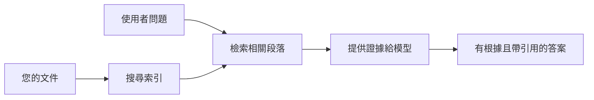

# 教 AI 根據您的文件回答問題：
## 系列一：RAG、Azure 與開源替代方案，以及何時適合微調

> 這是 2026 年系列的第一篇文章，回顧我在 2023 年關於 Azure AI Search + Azure OpenAI 文件問答的教學。

系列導航：[倉庫首頁](../README.md) | 下一篇：[系列二 - 從頭到尾建置本地開源 RAG 系統](./series-2-open-source-rag-end-to-end.md)

## 1. 介紹 - 回顧早期的 RAG 教學

2023 年，我撰寫了一對教學，介紹如何使用 Azure AI Search 及 Azure OpenAI 教 ChatGPT 從 PDF 文件回答問題。我寫了 [LangChain 版本](https://techcommunity.microsoft.com/blog/educatordeveloperblog/teach-chatgpt-to-answer-questions-using-azure-ai-search--azure-openai-lang-chain/3969713)，也與微軟首席雲端倡導經理 [Lee Stott](https://developer.microsoft.com/en-us/advocates/lee-stott) 共同撰寫了夥伴的 [Semantic Kernel 版本](https://techcommunity.microsoft.com/blog/educatordeveloperblog/teach-chatgpt-to-answer-questions-using-azure-ai-search--azure-openai-semantic-k/3985395)。當時，「在您的資料上使用 ChatGPT」這個概念對很多開發者仍感新鮮。教學用到了 Azure Blob Storage、Azure AI Search、Azure OpenAI、LangChain、Semantic Kernel 和類 FAISS 向量檢索，來回答 PDF 檔案中的問題。

當時的文章著重在一個簡單但重要的工作流程：上傳文件，建立索引，檢索相關內容，並讓模型根據該內容回答。

到了 2026 年，RAG 生態系統大幅成長。Azure AI Search 現在支援現代向量和混合檢索模式，Azure OpenAI 成為更廣泛的 Microsoft Foundry Models 生態系統的成員，且新版 v1 API 可使用標準 OpenAI 客戶端，不需每月更換 `api-version`。同時，開源方案如 LangGraph、LlamaIndex、Haystack、Qdrant、Milvus、Weaviate、Chroma、Ollama 及 vLLM 已成為實務上可用的 RAG 系統選擇。

這就是為什麼我想重訪這個主題。問題不再只是「如何建置 RAG？」，現在有很多建置方式，更重要的是「我在什麼情境下該選擇哪種架構？」

但核心問題沒有改變。

AI 模型不會自動知道您的文件內容。要建置有用的文件問答系統，您仍需可靠的檢索、依據、評估以及運營工作流程。

本文不是另一篇端到端的「與 PDF 聊天」教學。我想用我如今更關心的問題開始此更新系列：什麼時候您應選擇受管 Azure 架構，什麼時候應選擇開源 RAG 架構，以及微調何時真正有意義？

這是關於建置文件依據 AI 系統系列的第一篇。在本文，我們將專注於架構決策：為什麼 RAG 重要？何時 Azure 受管服務有用？何時開源替代方案合適？微調又應該放在哪裡？

經過建置和重訪文件問答系統，我變得不再關心哪個工具在示範中看起來最好，而更關心哪種架構能經得起真實用戶、文件變動、權限限制、失敗與維護考驗。

## 2. 為什麼您的 AI 需要搜尋系統

大型語言模型是在廣泛的公開和授權資料上訓練的。它們可能知道許多一般性主題，但不會自動知道您的私人 PDF、內部政策、企業程序、研究檔案、課堂教材、客戶支援紀錄，或最近更新的文件。

簡單來說，RAG 的想法是：與其指望模型記住所有文件，我們給它一個搜尋系統。當用戶提問時，系統先找到最相關的資訊片段，再將這些片段作為上下文給模型。

這很重要，因為許多真實世界的知識來源是私密的、持續變更、權限敏感、分散在多個系統、以多種格式撰寫，且資料量太大，無法直接貼入提示。

舉例來說，如果一所學校、企業或研究團隊擁有 10,000 份內部文件，模型若無法在適當時間取得正確部分，就無法可靠回答。

這常導致一個常見問題：

為什麼不直接微調模型？

微調是有用的，但對文件知識通常不是首選工具。如果知識經常變動、引用很重要，或存取權限重要，RAG 通常是更好的起點。微調較適合教模型行為、風格、輸出格式和任務標準。

## 3. RAG 架構實務

想像您在為一所學校建置 AI 助手。助手需要回答來自政策 PDF、課程指南、內部常見問題頁面和最近公告的問題。

如果學生問：「我可以在期末作業使用生成式 AI 嗎？」系統不應直接從模型的一般記憶回答。系統應先找到相關的學校政策，檢索 AI 使用的章節，再讓模型基於該依據回答。

這就是實務上的 RAG。

大致流程圖如下：

細節能更複雜，但基本概念簡單：模型不單獨回答，而是帶著檢索到的證據回答。

首先，文件從 Azure Blob Storage、SharePoint、GitHub 或內部 CMS 等存儲系統擷取。系統解析成文字，同時保留標題、頁碼、表格、章節、來源位置等有用結構。

接著將內容拆分成區塊。此步驟看似簡單，卻是系統最重要部分之一。區塊太小會失去周邊上下文，太大則可能包含不相關資訊，使檢索精準度降低。

拆分後，系統建立嵌入向量，並連同原始文字及檔名、頁碼、權限、文件版本、來源 URL 等元資料，儲存在可搜尋索引中。

用戶提問時，系統使用關鍵字搜尋、向量搜尋或混合搜尋檢索候選區塊，再用重排序器將最有用證據排到最前。

最後，模型接收問題與檢索到的證據。答案應建立在證據基礎上，並返回引用以供用戶檢視來源。

重點是，RAG 不只是「把 PDF 丟到向量資料庫裡」。答案品質取決於整個工作流程：解析、拆分、檢索、重排序、提示、引用和評估。

這就是為什麼文件結構很重要。在 PDF 裡，標題、表格、註腳或頁面邊界都可能改變段落含義。在 Azure 上，Document Layout 技能使用 Azure Document Intelligence 版面分析能力，產出結構意識的輸出，能提升 RAG 系統的拆分和檢索品質。

## 4. 自 2023 年以來的變化？

2023 年的教學當時是很好的起點：

- 使用 Azure Blob Storage 儲存 PDF 檔案。
- 用 Azure AI Search 建立索引。
- LangChain 負責連結檢索至 Azure OpenAI。
- FAISS 作為簡單的本地向量庫。
- 範例使用 `gpt-35-turbo` 與 `text-embedding-ada-002`。

到了 2026 年，現代版本應該反映多項變化。

首先，檢索成熟化。2023 年許多示範只用簡單的向量相似度搜索。如今混合檢索成為嚴肅文件問答的預設起點。Azure AI Search 支援在單次請求中結合關鍵字和向量查詢，並用 Reciprocal Rank Fusion 合併結果。語意排序器可重新排序全文、向量及混合結果的文字部分。

其次，擷取變得更智能。不是用應用程式代碼手動拆分每篇文件，而是 Azure AI Search 支援整合的向量化功能，包含拆分、嵌入和查詢時計算嵌入。對 PDF 和文件密集工作負載來說，Document Layout 技能可保留比固定大小區塊更多結構。

第三，協調更重要。困難往往不在於 LLM API 呼叫本身，而在處理失敗、重試、過時檢索、區塊品質、長時間工作流程、人為審查和大規模評估。這兒工作流程導向工具（如 LangGraph、LlamaIndex workflows、Haystack pipelines）和平台級評估與可觀察性工具，比起單線性鏈條更具價值。

第四，評估不再可選。示範用一個問題可能看起來厲害，但生產系統需要測試集、回歸檢查、檢索指標、依據檢查及監控。無評估，難辨系統是改進還是只是變動。

## 5. Azure 與開源 RAG 架構選擇

我認為有用的問題不是「Azure 比開源好嗎？」或「開源比 Azure 好嗎？」

有用的是：您要建立什麼系統？誰來操作？有哪些限制？不可接受的失敗模式是什麼？

當我剛開始建置文件問答範例時，我多半只關心檢索是否有效。是否能上傳 PDF、檢索並生成答案？這是合理的起步。

經過更多實務工作流程後，我的評估改變了。在選擇 RAG 架構前我現在會看四件事：

- 身份與權限
- 檢索品質
- 工作流程可靠性
- 運營所有權

這四個面向告訴你的，比單純模型基準測試多得多。

當企業整合是難點時，Azure 架構通常合理。如果團隊已仰賴 Microsoft Entra ID、Microsoft 365、Azure Storage、私有網路、角色基礎存取控制 (RBAC) 和 Azure 監控，Azure AI Search 與 Azure OpenAI 可減輕大量運營複雜度。在這種環境中，Azure 不只是模型 API，其價值在於周遭系統：身份、治理、受管搜尋、安全整合、支援與熟悉的操作流程。

當彈性是難點時，開源架構較適合。如果團隊需要本地推斷、雲端可攜性、自訂檢索管線、專門的重排序，或直接控制向量資料庫與模型服務層，開源架構會更合適。缺點是團隊需自行負責更多可靠性工作：備份、擴展、延遲、遷移、監控與安全。

實際上，很多正式 AI 系統並非純雲端原生或純開源，往往是混合系統，在運營簡單性、可攜性、治理及工程彈性間取得平衡。

例如，我不意外看到某系統使用 Azure OpenAI 存取模型、LangGraph 做工作流程編排、Azure 做部署托管，以及使用開源向量資料庫滿足特定檢索需求。這不是架構矛盾，而是為系統各部分選擇適合的受管服務和工程掌控層級。

我喜歡混合架構，當受管平台解決重要企業問題，而開源元件在重要彈性區域提供團隊自由度。

## 6. 實務決策指南

這是我會與團隊在選擇 RAG 架構前使用的決策表：

| 決策面向 | 當... Azure 受管架構優勢 | 當... 開源架構優勢 |
| --- | --- | --- |
| 身份與存取 | 企業 Entra ID、RBAC、受管身份及權限是核心 | 以自訂身份驗證、非 Microsoft 身份或應用特有存取邏輯為主 |
| 運營 | 團隊需要受管基礎設施、支援、SLA 與簡化入門 | 團隊能操作向量資料庫、模型服務、備份與擴展 |
| 檢索 | 大多需求可用混合搜尋、語意排序、篩選及元資料搜尋覆蓋 | 團隊需要自訂檢索、專門重排序或實驗性索引 |
| 可攜性 | 接受或偏好 Azure 生態系統整合 | 堅決避免雲端鎖定是必要條件 |
| 推斷 | Azure OpenAI 治理、網路與企業控管十分重要 | 需要本地推斷、自訂模型或自行託管服務 |
| 成本 | 降低工程與運營工作重於無微調基礎設施 | 規模大到需謹慎優化基礎設施 |
| 嘗試實驗 | 穩定性與企業整合重於經常更換元件 | 團隊快速迭代代理、工具、記憶與檢索工作流程 |

我的經驗法則很簡單：

- 當企業整合、安全與運營簡單是主要風險，從 Azure 開始。
- 當可攜性、客製化或本地控制是主要風險，從開源開始。
- 兩者都是時，使用混合架構。

這也是為什麼我不會在 2026 年 RAG 系列一開始就從程式碼寫起。程式碼重要，但架構選擇在實作之前。一個簡單示範能掩蓋最難決策，好的 RAG 系統會把這些抉擇明確呈現。

## 7. 微調的定位

微調常被與 RAG 一起提起，但我認為應該分開看。

當系統需要最新、私有、權限敏感或有據可查的知識時，RAG 通常是較佳方案。如果答案應引用文件、反映最新更新、或遵守用戶特定存取規則，檢索應是架構一部分。
微調在知識不是主要問題時更有用。當您希望模型遵循特定的輸出格式、符合特定領域的回應風格、穩定且一致地執行任務，或減少每次提示中所需的指令量時，它都能發揮作用。

在實務上，兩者可以協同工作。客服助理可能會使用 RAG 來檢索最新的政策，而微調後的模型則學會公司偏好的回答結構和語氣。

錯誤是在將微調視為文件庫的替代方案。當系統必須從最新、私密或有權限限制的資料中回答時，依然需要檢索功能。

## 8. 接下來本系列的方向

本文是決策層。在撰寫程式碼之前，我想明確說明取捨點：RAG 與微調，Azure 與開源，管理型服務與運營控制。

在進入實作之前，我想先提出一點：在許多企業 AI 系統中，模型只是一個元件。檢索品質、協調機制、評估、權限以及運營穩定性通常決定系統是否能超越展示階段取得成功。

接下來本系列的部分，我計劃深入探討以文件為基礎的 AI 系統的實務面：先建立本地端開源的 RAG 工作流程，再用 Azure AI Search 與 Azure OpenAI 重建相同情境，最後評估系統是否真正有效。

隨著系列進展，我可能會調整順序，但目標不變：擺脫簡單展示，展示如何思考可維護、可評估及可運營的 RAG 系統。

## 9. 參考資料與資源

原始教學：

- [Teach ChatGPT to Answer Questions: Using Azure AI Search & Azure OpenAI (Lang Chain)](https://techcommunity.microsoft.com/blog/educatordeveloperblog/teach-chatgpt-to-answer-questions-using-azure-ai-search--azure-openai-lang-chain/3969713)
- [Teach ChatGPT to Answer Questions: Using Azure AI Search & Azure OpenAI (Semantic Kernel)](https://techcommunity.microsoft.com/blog/educatordeveloperblog/teach-chatgpt-to-answer-questions-using-azure-ai-search--azure-openai-semantic-k/3985395)

Azure：

- [Azure AI Search REST API versions](https://learn.microsoft.com/en-us/rest/api/searchservice/search-service-api-versions)
- [Hybrid search in Azure AI Search](https://learn.microsoft.com/en-us/azure/search/hybrid-search-how-to-query)
- [Integrated vectorization in Azure AI Search](https://learn.microsoft.com/en-us/azure/search/vector-search-integrated-vectorization)
- [Document Layout skill in Azure AI Search](https://learn.microsoft.com/en-us/azure/search/cognitive-search-skill-document-intelligence-layout)
- [Chunk and vectorize by document layout](https://learn.microsoft.com/en-us/azure/search/search-how-to-semantic-chunking)
- [Semantic ranking in Azure AI Search](https://learn.microsoft.com/en-us/azure/search/semantic-search-overview)
- [Azure OpenAI / Microsoft Foundry API version lifecycle](https://learn.microsoft.com/en-us/azure/foundry/openai/api-version-lifecycle)
- [Foundry Models sold by Azure](https://learn.microsoft.com/en-us/azure/foundry/foundry-models/concepts/models-sold-directly-by-azure)
- [Microsoft Foundry fine-tuning considerations](https://learn.microsoft.com/en-us/azure/foundry/openai/concepts/fine-tuning-considerations)
- [Microsoft Foundry observability](https://learn.microsoft.com/en-us/azure/foundry/concepts/observability)
- [Run evaluations in Microsoft Foundry](https://learn.microsoft.com/en-us/azure/foundry/how-to/evaluate-generative-ai-app)

開源：

- [LangGraph documentation](https://docs.langchain.com/oss/python/langgraph/overview)
- [LlamaIndex documentation](https://developers.llamaindex.ai/python/framework/)
- [Haystack documentation](https://docs.haystack.deepset.ai/)
- [Qdrant documentation](https://qdrant.tech/documentation/overview/)
- [Milvus documentation](https://milvus.io/docs/overview.md)
- [Weaviate documentation](https://docs.weaviate.io/weaviate/current/)
- [Chroma documentation](https://docs.trychroma.com/docs/overview/introduction)
- [Ollama embeddings](https://docs.ollama.com/capabilities/embeddings)
- [vLLM OpenAI-compatible server](https://docs.vllm.ai/en/latest/serving/openai_compatible_server.html)
- [BGE embedding models](https://huggingface.co/BAAI/bge-large-en-v1.5)
- [E5 embedding models](https://huggingface.co/intfloat/e5-large-v2)
- [Instructor embedding models](https://huggingface.co/hkunlp/instructor-large)

下一篇：[系列 2 - 從頭到尾建立本地開源 RAG 系統](./series-2-open-source-rag-end-to-end.md)

---

<!-- CO-OP TRANSLATOR DISCLAIMER START -->
**免責聲明**：
此文件已使用 AI 翻譯服務 [Co-op Translator](https://github.com/Azure/co-op-translator) 進行翻譯。雖然我們努力追求準確性，但請注意自動翻譯可能包含錯誤或不準確之處。原始文件的母語版本應視為權威來源。對於關鍵資訊，建議採用專業人工翻譯。我們不對因使用此翻譯所產生的任何誤解或誤譯承擔責任。
<!-- CO-OP TRANSLATOR DISCLAIMER END -->