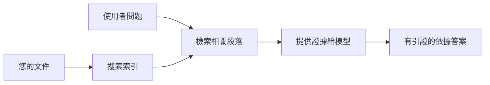

# 教 AI 根據您的文件回答問題：
## 系列 1：RAG、Azure vs 開源替代方案，以及微調何時合理

> 這是 2026 年系列的第一篇文章，回顧我在 2023 年進行的 Azure AI 搜尋 + Azure OpenAI 文件問答教學。

## 1. 介紹 - 重溫早期的 RAG 教學

2023 年，我製作了一對教學，關於如何教 ChatGPT 從 PDF 文件中回答問題，使用 Azure AI 搜尋和 Azure OpenAI。我撰寫了 [LangChain 版本](https://techcommunity.microsoft.com/blog/educatordeveloperblog/teach-chatgpt-to-answer-questions-using-azure-ai-search--azure-openai-lang-chain/3969713)，也與微軟的首席雲端推廣經理 [Lee Stott](https://developer.microsoft.com/en-us/advocates/lee-stott) 共同撰寫了伴隨的 [Semantic Kernel 版本](https://techcommunity.microsoft.com/blog/educatordeveloperblog/teach-chatgpt-to-answer-questions-using-azure-ai-search--azure-openai-semantic-k/3985395)。當時，「資料上的 ChatGPT」的概念對許多開發者而言仍然很新。這些教學使用 Azure Blob Storage、Azure AI 搜尋、Azure OpenAI、LangChain、Semantic Kernel 以及類 FAISS 的向量檢索，從 PDF 文件回答問題。

那篇早期文章聚焦於一個簡單但重要的工作流程：上傳文件、建立索引、檢索相關內容，並根據內容請模型回答。

到了 2026 年，RAG 生態系統大幅成長。Azure AI 搜尋現已支援現代向量與混合檢索模式，Azure OpenAI 是微軟更廣泛的 Foundry 模型生態系的一部分，而新版 v1 API 可使用標準的 OpenAI 客戶端，無需每月更改 `api-version`。同時，開源選項如 LangGraph、LlamaIndex、Haystack、Qdrant、Milvus、Weaviate、Chroma、Ollama 和 vLLM 也成為實際的 RAG 系統選擇。

這也是我想回到這個主題的原因。問題不再只是「如何建立 RAG？」現在有很多方法來構建，且更重要的問題是「對於我的情況，應該選擇哪種架構？」

但核心問題並未改變。

AI 模型並不會自動知道您的文件。要建立有用的文件問答系統，您仍然需要可靠的檢索、基礎依據、評估和運營工作流程。

本文並不是另一個端到端「與 PDF 聊天」的教學。我想以我現在更在意的問題開始這個更新系列：何時選擇管理式 Azure 架構、何時選擇開源 RAG 堆疊，以及微調到底何時合理？

這是關於建立文件根據 AI 系統系列的第一篇文章。這部分將聚焦架構決策：為什麼 RAG 很重要、何時 Azure 管理服務有用、何時開源替代方案合理，以及微調的定位。

在建立和回顧文件問答系統的過程中，我對哪個工具在示範中看起來最好變得不那麼感興趣，而更關注哪種架構能夠經得起真實用戶、文件變動、權限、故障和維護的考驗。

## 2. 為什麼您的 AI 需要搜尋系統

大型語言模型訓練於廣泛的公共及授權資料。它們可能對一般議題知道很多，但不會自動知道您的私人 PDF、內部政策、企業程序、研究檔案、課堂教材、客服筆記或最近更新的文件。

理解 RAG 的簡單方式是：我們不期望模型記住每份文件，而是提供搜尋系統。當使用者提問時，系統先找到最相關的資訊片段，然後將這些片段作為上下文給模型。

這很重要，因為許多真實世界知識來源是私密的，不斷變動，須考量權限，分散存放於多系統，以多種格式書寫，且太龐大無法直接貼入提示。

例如，若學校、公司或研究團隊擁有 10,000 份內部文件，除非系統能適時檢索正確片段，模型無法可靠地從這些文件回答問題。

這自然引出一個常見問題：

為什麼不直接微調模型？

微調有其用途，但通常不是文件知識的首選工具。若知識經常變動、需引用來源或須遵守存取權限，RAG 通常是較佳起點。微調較適合教導行為、風格、輸出格式及任務模式。

## 3. RAG 架構實務

想像您為一所學校建構 AI 助理。該助理需從政策 PDF、課程指南、內部 FAQ 頁面以及最近的公告回答問題。

如果學生問：「我可不可以在期末作業使用生成式 AI？」，系統不應該從模型的一般記憶回答，而是先找到相關學校政策，擷取 AI 使用相關章節，再請模型根據證據回答。

這就是 RAG 在實務上的樣貌。

高層次來說，流程可以想像如下：

細節可以更複雜，但基本想法很簡單：模型不是單獨回答，它是帶著檢索到的證據回答。

首先，文件從儲存系統（如 Azure Blob Storage、SharePoint、GitHub 或內部 CMS）導入。系統接著將它們解析成文字，同時保留有用結構，例如標題、頁碼、表格、章節和來源位置。

接下來，內容被切割成片段。這步看似簡單，實則系統最重要的部分之一。若片段太小，可能失去上下文；太大則可能包含無關資訊，降低檢索精確度。

切割完成後，系統建立嵌入向量並與原文和檔名、頁碼、權限、文件版本和來源 URL 等元資料一起存入可搜索索引。

當用戶提問時，系統使用關鍵字檢索、向量檢索或混合檢索找出候選片段。重新排序工具（reranker）會調整片段順序，將最有用證據置頂。

最後，模型接收問題與檢索的證據。回答應該以證據為依據，並附上引文讓用戶能檢視來源。

重點是，RAG 不只是「把 PDF 放進向量資料庫」。答案品質取決整個工作流程：解析、切割、檢索、重排序、提示、引用和評估。

這也是為什麼文件結構很重要。在 PDF 中，標題、表格、註腳或頁面邊界能改變段落含義。在 Azure 上，Document Layout 技能利用 Azure Document Intelligence 版面解析功能，產生具結構感知的輸出，有助提升 RAG 系統的切割和檢索品質。

## 4. 與 2023 年相比有何改變？

2023 年教學在當時是很好的起點：

- Azure Blob Storage 儲存 PDF 檔案。
- Azure AI 搜尋建立內容索引。
- LangChain 將檢索串接 Azure OpenAI。
- FAISS 作為簡單的本地向量庫。
- 範例使用 `gpt-35-turbo` 和 `text-embedding-ada-002`。

到了 2026 年，現代版本應反映多項變化。

首先，檢索更成熟。2023 年，許多示範使用簡單的向量相似度搜尋。如今，混合檢索是嚴肅文件問答的預設起點。Azure AI 搜尋支援混合搜尋，結合關鍵字與向量查詢於同一請求，並以 Reciprocal Rank Fusion 合併結果。語義排序器可重新排序全文、向量和混合結果的文字面。

其次，導入更先進。Azure AI 搜尋支援整合式向量化，進行切割、嵌入及查詢時間向量化，無需手動拆分文件。對於 PDF 和文件量大負載，Document Layout 技能能保留比固定大小切割更多結構。

第三，編排更重要。重點往往不只是 LLM API 呼叫本身，而是處理失敗、重試、過時檢索、切割品質、長流程、人工審查和大量評估。這使得 LangGraph、LlamaIndex 工作流程、Haystack 管線，以及平台級評估和可觀察性工具比單一線性鏈路更相關。

第四，評估不再可選。一個示範用一句題目可能很亮眼，但生產系統需有測試集、迴歸檢查、檢索指標、基礎依據檢查和監控。沒有評估很難知道系統到底是在改進還是僅僅在變動。

## 5. 如何在 Azure 與開源 RAG 堆疊間選擇

我認為有用的問題不是「Azure 比開源好嗎？」或「開源比 Azure 好嗎？」

有用的問題是：您在建置什麼系統？誰會操作它？有哪些限制？哪些失敗情境是不能接受的？

剛開始做文件問答範例時，我大多只關心檢索是否可行。我能否上傳 PDF、搜尋它們並產生答案？這是合理的起點。

在經歷更現實的 AI 工作流程後，我的評估改變。選擇 RAG 堆疊前，我現在會先看四個方向：

- 身份與權限
- 檢索品質
- 工作流程可靠度
- 運營擁有權

這四個面向，比只看模型基準指標能告訴你更多。

基於 Azure 的架構通常在企業整合是最大挑戰情況下合理。如果團隊已依賴 Microsoft Entra ID、Microsoft 365、Azure儲存、私有網路、基於角色的存取控制（RBAC）和 Azure 監控，Azure AI 搜尋與 Azure OpenAI 可減少大量運維複雜度。在這環境下，Azure 不只是模型 API，其價值是整個系統環境：身份、治理、管理搜尋、安全整合、支援與熟悉流程。

開源架構通常在彈性最重要時合理。若團隊需要本地推理、跨雲攜帶、客製檢索管線、專門重排序或對向量資料庫與模型服務層有直接控制，開源堆疊可能更合適。代價是團隊需自行負責更多可靠度工作：備份、擴充、延遲、遷移、監控與安全。

實務上，許多生產 AI 系統不是純粹雲端原生或純開源。它們常是混合系統，平衡運營簡單性、攜帶性、治理與工程彈性。

例如，我不會驚訝看到系統使用 Azure OpenAI 進行模型存取，LangGraph 進行工作流程編排，Azure 托管部署，並用開源向量資料庫處理特定檢索需求。這不是架構不一致，而是為系統每個部分選擇合適的管理服務和工程控管層級。

我喜歡混合架構，當管理平台解決重要企業問題，而開源元件讓團隊在真正重要的地方擁有彈性。

## 6. 實務決策指南

以下是我在選擇 RAG 堆疊前會和團隊一起使用的決策表：

| 決策領域 | Azure 管理式堆疊較適合的情況... | 開源堆疊較適合的情況... |
| --- | --- | --- |
| 身份與存取 | Entra ID、RBAC、管理身份和企業權限是核心 | 自訂認證、非微軟身份或應用專屬存取邏輯居多 |
| 運營 | 團隊想要管理式基礎架構、支援、SLA 和更簡易入門 | 團隊能操作向量資料庫、模型服務、備份和擴充 |
| 檢索 | 混合搜索、語義排序、過濾器和元資料搜尋涵蓋多數需求 | 團隊需要自訂檢索、專門重排序或實驗性建索 |
| 攜帶性 | Azure 生態系統整合可以接受或偏好 | 必須避免雲端鎖定是嚴格要求 |
| 推理 | Azure OpenAI 管理、網路和企業控管重要 | 需要本地推理、自訂模型或自行部署服務 |
| 成本 | 降低工程與運維工作重於基礎設施調校 | 規模足夠大，需要細膩基礎設施優化 |
| 試驗 | 穩定性與企業整合比頻繁改動元件更重要 | 團隊快速迭代代理、工具、記憶與檢索工作流程 |

我的經驗法則很簡單：

- 企業整合、安全與運維簡便是主要風險時，從 Azure 開始。
- 攜帶性、客製化或本地控管是主要風險時，從開源開始。
- 兩者皆是時，使用混合堆疊。

這也是為何我不會從 2026 年的 RAG 系列一開始就直攻程式碼。程式碼固然重要，架構選擇應在實作之前。簡單示範常常掩蓋最重要的抉擇。好的 RAG 系統會讓這些選擇明確呈現。

## 7. 微調何時合理

微調經常與 RAG 一起提及，但我認為兩者需區分。

當系統需要更新、私密、權限敏感或以來源為基礎的知識時，RAG 通常是較好的選擇。若答案應該引用文件、反映最新更新或尊重用戶特定訪問規則，檢索應該是架構的一部分。

微調較有用的是當知識不是主要問題。它能幫助模型遵循特定輸出格式、匹配領域特定回應風格、更穩定地執行任務，或減少每次提示中指令的需求。
在實務上，兩者可以一起合作。支援助理可能會使用 RAG 來檢索最新的政策，同時微調模型則學習公司的偏好答案結構和語氣。

錯誤在於將微調視為文件庫的替代品。當系統必須從最新的、私人或權限敏感的資料中回答問題時，它並不能取代檢索的需求。

## 8. 本系列的後續發展

本文是決策層。在寫程式碼之前，我想先明確做出取捨：RAG vs 微調、Azure vs 開源、託管服務 vs 運營控制。

在進入實作之前，我想先留下一點：在許多企業 AI 系統中，模型只是其中一個組件。檢索品質、協調、評估、權限及運營可靠性通常是決定系統能否超越演示階段的關鍵。

在本系列後續章節中，我計劃更深入探討基於文件的 AI 系統的實務面向：如何構建基於 Azure 的架構、開源替代方案在實務中的比較，以及如何評估 RAG 系統是否真正有效。

我可能會隨著系列發展調整順序，但目標保持不變：跳脫簡單演示，展示如何思考能夠維護、評估及運營的 RAG 系統。

## 9. 參考資料與資源

原始教學：

- [Teach ChatGPT to Answer Questions: Using Azure AI Search & Azure OpenAI (Lang Chain)](https://techcommunity.microsoft.com/blog/educatordeveloperblog/teach-chatgpt-to-answer-questions-using-azure-ai-search--azure-openai-lang-chain/3969713)
- [Teach ChatGPT to Answer Questions: Using Azure AI Search & Azure OpenAI (Semantic Kernel)](https://techcommunity.microsoft.com/blog/educatordeveloperblog/teach-chatgpt-to-answer-questions-using-azure-ai-search--azure-openai-semantic-k/3985395)

Azure：

- [Azure AI Search REST API versions](https://learn.microsoft.com/en-us/rest/api/searchservice/search-service-api-versions)
- [Hybrid search in Azure AI Search](https://learn.microsoft.com/en-us/azure/search/hybrid-search-how-to-query)
- [Integrated vectorization in Azure AI Search](https://learn.microsoft.com/en-us/azure/search/vector-search-integrated-vectorization)
- [Document Layout skill in Azure AI Search](https://learn.microsoft.com/en-us/azure/search/cognitive-search-skill-document-intelligence-layout)
- [Chunk and vectorize by document layout](https://learn.microsoft.com/en-us/azure/search/search-how-to-semantic-chunking)
- [Semantic ranking in Azure AI Search](https://learn.microsoft.com/en-us/azure/search/semantic-search-overview)
- [Azure OpenAI / Microsoft Foundry API version lifecycle](https://learn.microsoft.com/en-us/azure/foundry/openai/api-version-lifecycle)
- [Foundry Models sold by Azure](https://learn.microsoft.com/en-us/azure/foundry/foundry-models/concepts/models-sold-directly-by-azure)
- [Microsoft Foundry fine-tuning considerations](https://learn.microsoft.com/en-us/azure/foundry/openai/concepts/fine-tuning-considerations)
- [Microsoft Foundry observability](https://learn.microsoft.com/en-us/azure/foundry/concepts/observability)
- [Run evaluations in Microsoft Foundry](https://learn.microsoft.com/en-us/azure/foundry/how-to/evaluate-generative-ai-app)

開源：

- [LangGraph documentation](https://docs.langchain.com/oss/python/langgraph/overview)
- [LlamaIndex documentation](https://developers.llamaindex.ai/python/framework/)
- [Haystack documentation](https://docs.haystack.deepset.ai/)
- [Qdrant documentation](https://qdrant.tech/documentation/overview/)
- [Milvus documentation](https://milvus.io/docs/overview.md)
- [Weaviate documentation](https://docs.weaviate.io/weaviate/current/)
- [Chroma documentation](https://docs.trychroma.com/docs/overview/introduction)
- [Ollama embeddings](https://docs.ollama.com/capabilities/embeddings)
- [vLLM OpenAI-compatible server](https://docs.vllm.ai/en/latest/serving/openai_compatible_server.html)
- [BGE embedding models](https://huggingface.co/BAAI/bge-large-en-v1.5)
- [E5 embedding models](https://huggingface.co/intfloat/e5-large-v2)
- [Instructor embedding models](https://huggingface.co/hkunlp/instructor-large)

---

<!-- CO-OP TRANSLATOR DISCLAIMER START -->
**免責聲明**：
此文件已使用 AI 翻譯服務 [Co-op Translator](https://github.com/Azure/co-op-translator) 進行翻譯。雖然我們努力追求準確性，但請注意自動翻譯可能包含錯誤或不準確之處。原始文件的母語版本應視為權威來源。對於關鍵資訊，建議採用專業人工翻譯。我們不對因使用此翻譯所產生的任何誤解或誤譯承擔責任。
<!-- CO-OP TRANSLATOR DISCLAIMER END -->